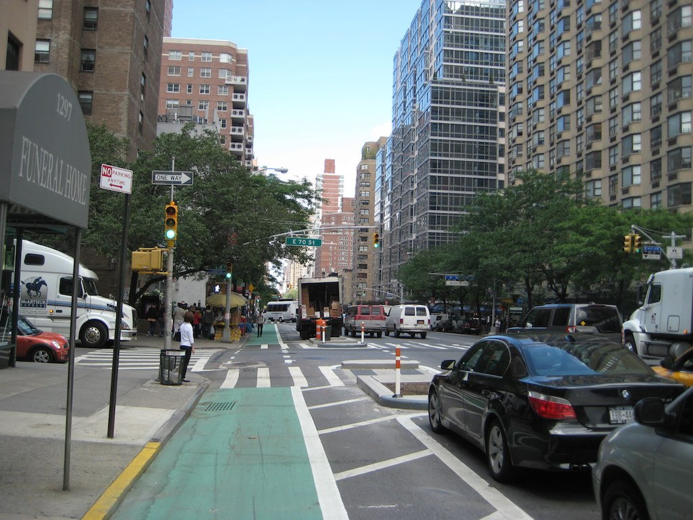
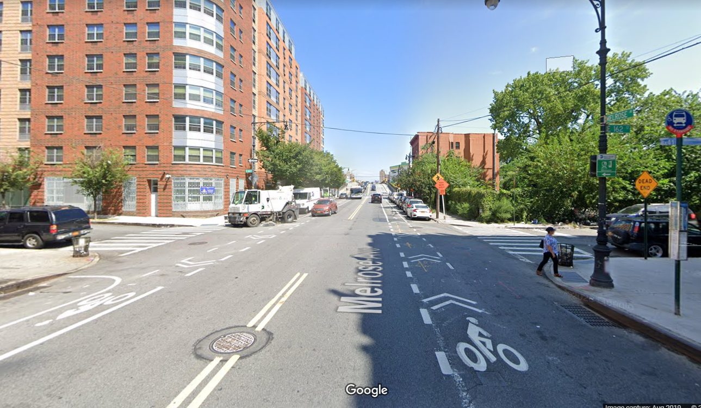
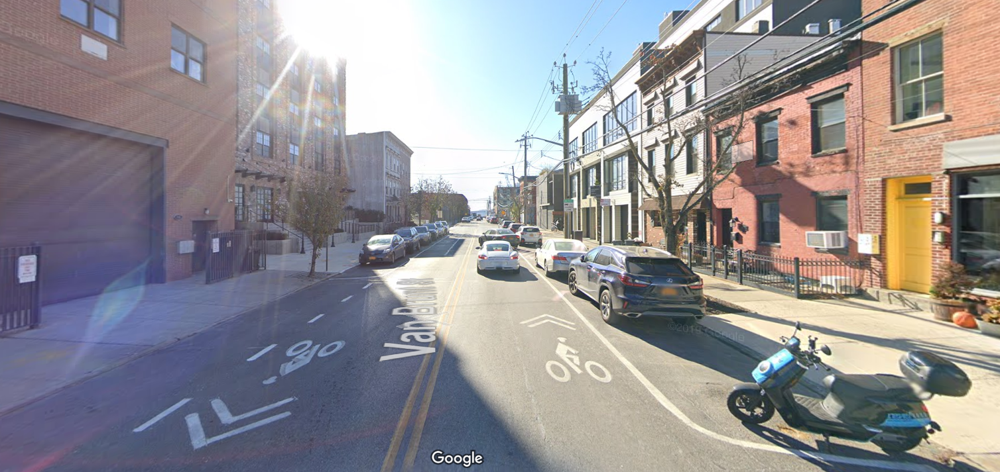
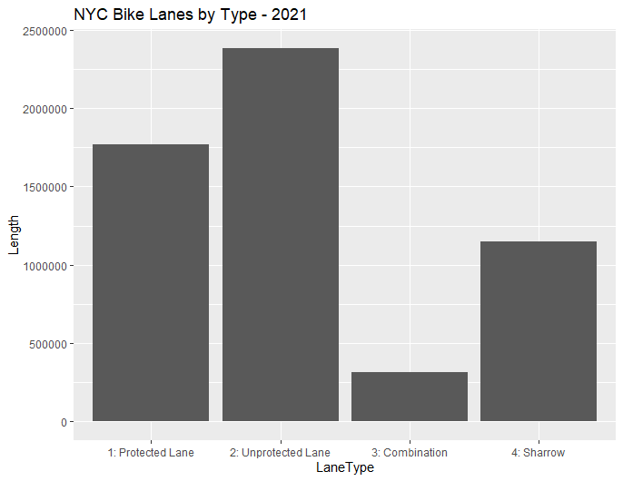
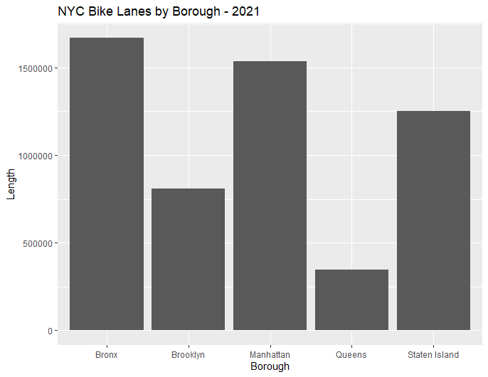
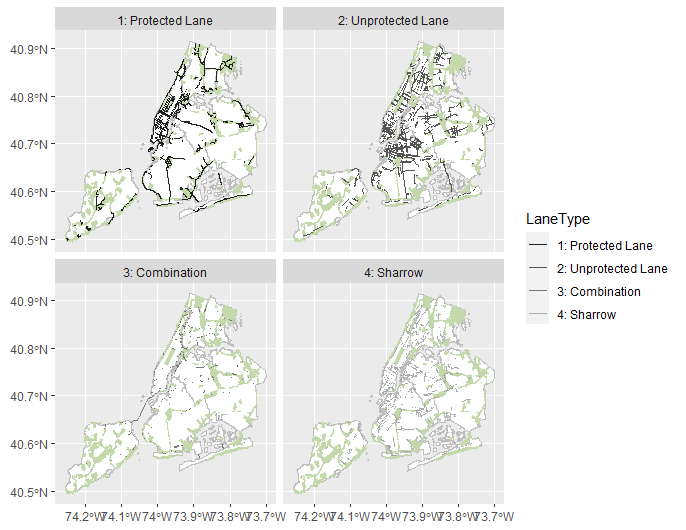
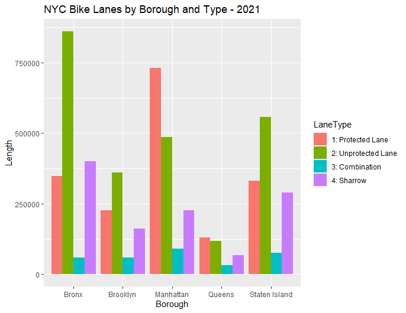

# Data wrangling / Exploratory analysis

### Bike Lane Analysis

There are three main categories of bike lanes in the data, which we have termed Protected, Unprotected, and Sharrow. A fourth category, Combination, is comprised of those road segments with a combination of the other three bike lane categories. 

| Protected | Unprotected | Sharrow |
|-----------|-------------|---------|
||||
| bike lane is separated from vehicle traffic by parked cars | bike lane is painted next to the vehicle lane | sharrow symbol instructs cars to share vehicle lane with bikes |

Unprotected bike lanes are the most common type found in New York City, while the borough of the Bronx has the highest bike lane mileage of any borough.

  

From glancing at a map of these lanes across the city, we get a sense that the lane types are not evenly distributed throughout the 5 boroughs of New York City. 

Indeed, Manhattan hosts the largest share of protected bike lanes, while in Brooklyn, Staten Island, and the Bronx, unprotected lanes are the most common.

Our trip data begins in 2018, so it is important to identify the bike lanes that have been added to the network since 2018. 

### Trip Data Cleaning

There are three types of data that needed to be clean. 

The first type is that the tracks are outside of New York City, and they are not connect to the NYC. Like Figure 1, which is March 5th, there are tracks in Montreal. 

Figure 1. Tracks in March 5th, 2018.

The other type is that the tracks are outside of New York City, and they are connected to the NYC. Like Figure 2, the tracks fly outside of USA. 

Figure 2. Tracks in March 25th, 2018.

The first type of data could be cleaned by using clip. We clip the trip line strings within the NYC boundary. For the second type, we at first buffered the NYC boundary, then do the clip, and we also find out the points which intersect with the buffered boundary. To illustrate, we need to buffer the NYC boundary because some of tracks are close to shorelines. If the shape file of boundary is not buffered, these tracks will not be included. Then we select out the linestrings which intersect with the buffered boundary. 

#### The third type is more complicated.  
The trips is inside NYC, however, when using mapview to visualize the basemap, we find that these tracks are not aligned with existing roads. 

Figure 3. July 5th, 2018.

When we zoom in, we found a lot of similar issues. This is a snapshot of July, 5th. 

 

Even when we use more fine-grained boundary, like shorlines of NYC to clip the data, it is still hard for R to tell whether a specific track is valid. 

 

### Part 2 Spatial and Temporal Visualizations

#### Ridership Trend in 2018

 

The ridership by 24-hours, 2018

As you can see from the figure above, the trend within a day, 24 hours, remains similar for all 10 months. The morning peak appreas around 12:00 pm and the evening peak appears around 9:00 pm. Ridership decrease in midnight and early morning, the lowest ridership appears in 7:30 am.

 

The ridership by day of the week, 2018

Surprisingly, the peak of the ridership does not appears during weekends.The ridership trend by day of the week varies between different months. 

 

The ridership by month, 2018

No obvious trends/patterns

#### Ridership Trend in July, 2018

The weather and temperature in July is most suitable for cycling. Therefore we focus on ridership in July and see the biking trend within the month.

 

There is clearly a daily periodicity

### Manhattan 
#### Ridership Trend on roads in March, year 2018 and year 2019

Due to the size of data, we focus on Manhattan in this part of visualization. 

To further clean up problematic trips within the selected boundary, we consider changing linestring of trip data into points. Later, we select only the points which are falling inside the routes. The points are then grouped by their unique index. Additionally, in order to make them overlap better, we make a 15 feet buffer on route data by using ArcGIS.
However, during this workflow, we are changing linestring to points, a progress that add much more data on original dataset. Therefore, we decide to select part of original data based on their temporal characteristics.

We are comparing trips in March, 2018 and trips in March, 2019. The following graphs are daily trends and hourly trends in March for each year.

 

  

From the figures, we could see that, overall, there are much more trips in March 2019. There is no clear daily trend. However, in both years, the number of trips peak at similar days. Hence, March 10th and March 20th are selected as days which have smaller number of trips and larger number of trips.

Moreover, there is a similar hourly trend that the number of trips peaks at 23pm and minimizes at 8am. Because there it not enough data to do clear comparison at 8am, we only use 23pm.

In the process of changing linestring to points, aiming to keep data’s attributes, we use ArcGIS to help us do the transformation. We use the tool, Generate Pointes Along Lines, and create the points as 5%. In other words, for one string of trip data, there will be 100%/5% = 20 number of points.

 

After transformation, only the points which locate inside the boundary of routes are kept. Later, for each route, the points are grouped by their identical index, and we count the number of trips in one route.

Here is the map of trips in March 10th, year 2018 and year 2019.

 

Also, here is the table that describes the additional trips of added bike infrastructures:
| Street      | Count (2018) | Count (2019) |
| ----------- | ----------- |-------------|
| 	5 AVENUE  | 0           | 2           |
| BIKE PATH   | 0           | 1           |
| BROADWAY    | 0           | 7           |
|HUDSON RIVER GREENWAY|0| 1|

Here is the map of trips in March 20th, year 2018 and year 2019.

 

Moreover, the map of trips at 23pm in March is also made.

### Brooklyn
To compare with the patterns in Manhattan, we also created the ridership analysis on the same days in Brooklyn

Here is the bike ridership on March 10th, Brooklyn

Here is the bike ridership on March 20th, Brooklyn

### OUR QUESTIONS
  1. **Question about big datasets**: Should we train our model on one Borough (Manhattan has the most well-built bikelane systems and the most trips) and then test our model on other boroughs? 
    -- However Manhattan don't have many new bikelanes in 2018 (Because it was already well-built). If we want to model the impact of new infra on the bike ridership, we are not sure whether that will have an impact on the accuracy of our model.
    
    
  2. When comparing March 2018 and March 2019, 2019 has many more trips. Would that be a problem for our model?
  
  
  3. Methods to count trips on each roads. Are we in the right direction?  
    - Our method: create a buffer of each road segment (15 feet) --> linestring to point --> clip points within a buffer of the road --> spatial join the point to road segment --> conver points back to bike trips --> calculate bike trips on each road (group by road name/id) 
    - Question 1: When doing spatial join, points are sometimes intersected with multiple roads, which will create multiple records in the data set, then create several trips because some points are duplicated. Will that matter? 
    - Question 2: Is 15 feet an appropriate buffer range? 
    - Question 3: When turn line into point, which point placement method should we choose? (by distance or by percentage?)
    
    
   4. **Question about big datasets**: Even with subset of data, R became extremely slow when doing visualization or doing spatial operations. Are there any tricks for dealing with big dataset?
  

