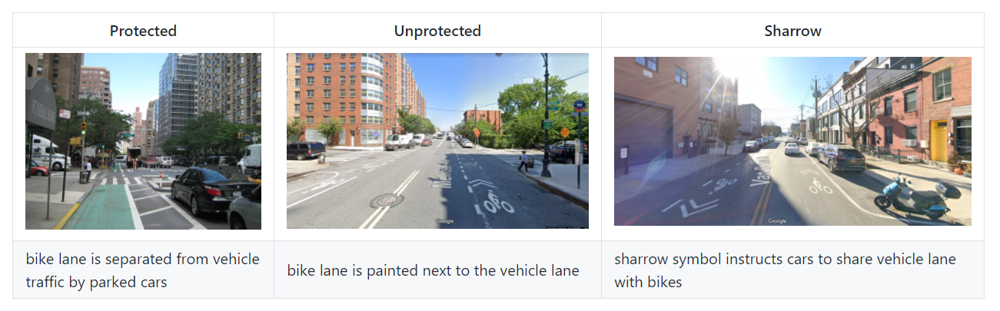

```{r setup, include=FALSE}
knitr::opts_chunk$set(echo = TRUE)

library(sf)
library(tidyverse)
library(ggplot2)
library(mapview)
library(RSocrata)
library(ggthemes)
library(kableExtra)

setwd('C:/Users/katee/Box Sync/Practicum/shp/')

bikelane_17d<- st_read('bikelane_17d.shp')
bikelane_20d<- st_read('bikelane_20d.shp')


new_18 <- st_read('bikelane_1718Diff_2.shp')
new_19 <- st_read('bikelane_1819Diff_2.shp')
new_20 <- st_read('bikelane_1920Diff_2.shp')


boroughs<- st_read('https://data.cityofnewyork.us/resource/7t3b-ywvw.geojson')
ntas<- st_read('https://data.cityofnewyork.us/resource/q2z5-ai38.geojson')

parks<- st_read('for_basemap/geo_export_8469ffba-1951-4e52-916c-c9c4dfa54c18.shp')
big_parks<-subset(parks, parks$acres>30)

#get rid of excess columns
new_18<- new_18%>%
  select(120:242)

new_19<- new_19%>%
  select(120:241)

new_20<- new_20%>%
  select(120:244)

# add lane category
new_18$LaneType <- '3: Combination'
new_18$LaneType[new_18$BikeLane_1=='1']<- '1: Protected Lane'
new_18$LaneType[new_18$BikeLane_1=='2']<- '2: Unprotected Lane'
new_18$LaneType[new_18$BikeLane_1=='3']<- '4: Sharrow'

new_19$LaneType <- '3: Combination'
new_19$LaneType[new_19$BikeLane_1=='1']<- '1: Protected Lane'
new_19$LaneType[new_19$BikeLane_1=='2']<- '2: Unprotected Lane'
new_19$LaneType[new_19$BikeLane_1=='3']<- '4: Sharrow'

new_20$LaneType <- '3: Combination'
new_20$LaneType[new_20$BikeLane_1=='1']<- '1: Protected Lane'
new_20$LaneType[new_20$BikeLane_1=='2']<- '2: Unprotected Lane'
new_20$LaneType[new_20$BikeLane_1=='3']<- '4: Sharrow'

bikelane_17d$LaneType <- '3: Combination'
bikelane_17d$LaneType[bikelane_17d$BikeLane=='1']<- '1: Protected Lane'
bikelane_17d$LaneType[bikelane_17d$BikeLane=='2']<- '2: Unprotected Lane'
bikelane_17d$LaneType[bikelane_17d$BikeLane=='3']<- '4: Sharrow'


bikelane_20d$LaneType <- '3: Combination'
bikelane_20d$LaneType[lane2_20d$BikeLane=='1']<- '1: Protected Lane'
bikelane_20d$LaneType[lane2_20d$BikeLane=='2']<- '2: Unprotected Lane'
bikelane_20d$LaneType[lane2_20d$BikeLane=='3']<- '4: Sharrow'


#add boro name
new_18$Borough <- 'Manhattan'
new_18$Borough[new_18$LBoro_1=='2']<- 'Bronx'
new_18$Borough[new_18$LBoro_1=='3']<- 'Brooklyn'
new_18$Borough[new_18$LBoro_1=='4']<- 'Queens'
new_18$Borough[new_18$LBoro_1=='5']<- 'Staten Island'

new_19$Borough <- 'Manhattan'
new_19$Borough[new_19$LBoro_1=='2']<- 'Bronx'
new_19$Borough[new_19$LBoro_1=='3']<- 'Brooklyn'
new_19$Borough[new_19$LBoro_1=='4']<- 'Queens'
new_19$Borough[new_19$LBoro_1=='5']<- 'Staten Island'

new_20$Borough <- 'Manhattan'
new_20$Borough[new_20$LBoro_1=='2']<- 'Bronx'
new_20$Borough[new_20$LBoro_1=='3']<- 'Brooklyn'
new_20$Borough[new_20$LBoro_1=='4']<- 'Queens'
new_20$Borough[new_20$LBoro_1=='5']<- 'Staten Island'

#if sum of road <1000 ft, drop all segments with that road name
new_18_clean<- new_18%>%
  group_by(Street_1, LaneType)%>%
  summarize(Length=sum(SHAPE_Le_1),
            Borough=first(Borough))%>%
  filter(Length>1000)

new_19_clean<- new_19%>%
  group_by(Street_1, LaneType)%>%
  summarize(Length=sum(SHAPE_Le_1),
            Borough=first(Borough))%>%
  filter(Length>1000)

new_20_clean<- new_20%>%
  group_by(Street_1, LaneType)%>%
  summarize(Length=sum(SHAPE_Le_1),
            Borough=first(Borough))%>%
  filter(Length>1000)


```
# New York City Bike Infrastructure & Cycling Patterns

### Use Case
Our client is the New York City Department of Transportation. They have shared two datasets with us
- LION: street centerlines over time
- Bike Trips: linestrings of select trips taken using NYC's bikeshare system 2018-2021

Our goal is to use these two datasets to analyze the impact of bicycle infrastructure changes on the routes chosen by cyclists over time. We will analyze bike ridership on streets that have had new bike lanes added during our study period (2018-2020) before and after the infrastructure investment. We plan to use a difference in differences approach to calculate the estimate the impact of a particular bike lane on changing ridership patterns. 


# Bike Lane Analysis

### Types of Bike Lanes
There are three main categories of bike lane in New York City's LION  data: **Protected Lanes, Unprotected Lanes,** and **Sharrows.** A fourth category, **Combination**, is comprised of street segments with a combination of the other three bike lane categories.



Unprotected bike lanes are the most common type found in New York City, while the borough of the Bronx has the highest bike lane mileage of any borough.

```{r cars}

```

## Current Lanes by Type
```{r echo=FALSE, warning=FALSE}
ggplot()+
  geom_sf(data=boroughs, color='#222222', fill='#222222')+
  geom_sf(data=big_parks, color='#4c6350', fill='#4c6350')+
  geom_sf(data=new_18_clean, aes(color = LaneType), size=0.9)+
  scale_colour_manual(values = c('#F55536','#f57f36', '#f7ac2a', '#fcd93a'))+
  labs(title='2018: New Bike Lanes by Type')
```
