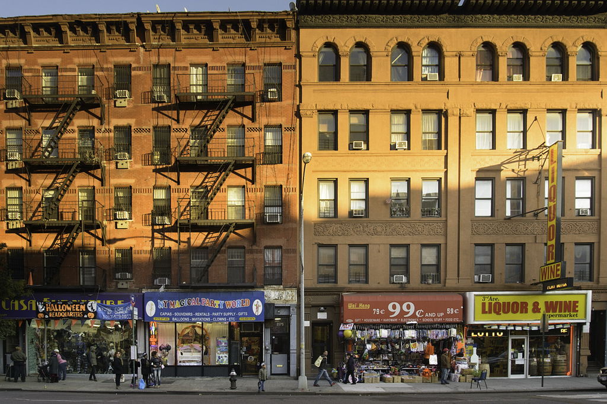
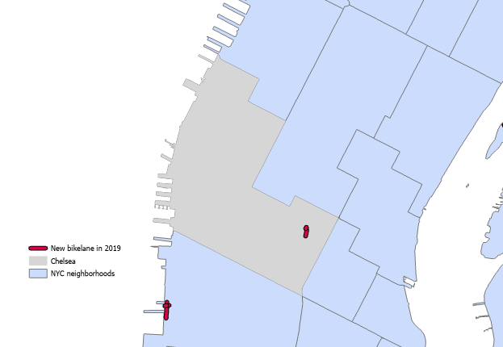
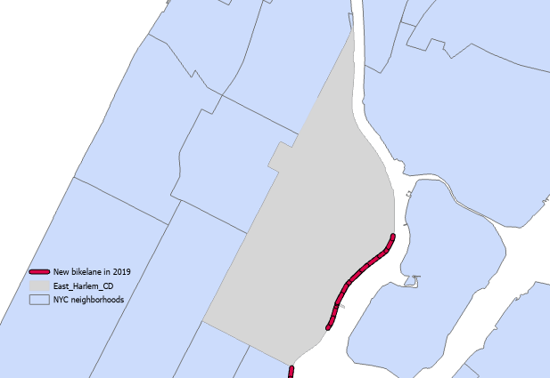

```{r setup, include=FALSE}
knitr::opts_chunk$set(echo = TRUE)

library(sf)
library(tidyverse)
library(ggplot2)
library(mapview)
library(RSocrata)
library(ggthemes)
library(kableExtra)
library(viridis)
library(lubridate)
library(tigris)
library(tidycensus)
library(riem)
library(gridExtra)
library(knitr)
library(RSocrata)
library(httr)
library(rgdal)

setwd('C:/Users/katee/Box Sync/Practicum/shp/')

bikelane_17d<- st_read('bikelane_17d.shp')
bikelane_20d<- st_read('bikelane_20d.shp')


new_18 <- st_read('bikelane_1718Diff_2.shp')
new_19 <- st_read('bikelane_1819Diff_2.shp')
new_20 <- st_read('bikelane_1920Diff_2.shp')


boroughs<- st_read('https://data.cityofnewyork.us/resource/7t3b-ywvw.geojson')
ntas<- st_read('https://data.cityofnewyork.us/resource/q2z5-ai38.geojson')

parks<- st_read('for_basemap/geo_export_8469ffba-1951-4e52-916c-c9c4dfa54c18.shp')
big_parks<-subset(parks, parks$acres>30)

#get rid of excess columns
new_18<- new_18%>%
  select(120:242)

new_19<- new_19%>%
  select(120:241)

new_20<- new_20%>%
  select(120:244)

# add lane category
new_18$LaneType <- '3: Combination'
new_18$LaneType[new_18$BikeLane_1=='1']<- '1: Protected Lane'
new_18$LaneType[new_18$BikeLane_1=='2']<- '2: Unprotected Lane'
new_18$LaneType[new_18$BikeLane_1=='3']<- '4: Sharrow'

new_19$LaneType <- '3: Combination'
new_19$LaneType[new_19$BikeLane_1=='1']<- '1: Protected Lane'
new_19$LaneType[new_19$BikeLane_1=='2']<- '2: Unprotected Lane'
new_19$LaneType[new_19$BikeLane_1=='3']<- '4: Sharrow'

new_20$LaneType <- '3: Combination'
new_20$LaneType[new_20$BikeLane_1=='1']<- '1: Protected Lane'
new_20$LaneType[new_20$BikeLane_1=='2']<- '2: Unprotected Lane'
new_20$LaneType[new_20$BikeLane_1=='3']<- '4: Sharrow'

bikelane_17d$LaneType <- '3: Combination'
bikelane_17d$LaneType[bikelane_17d$BikeLane=='1']<- '1: Protected Lane'
bikelane_17d$LaneType[bikelane_17d$BikeLane=='2']<- '2: Unprotected Lane'
bikelane_17d$LaneType[bikelane_17d$BikeLane=='3']<- '4: Sharrow'


bikelane_20d$LaneType <- '3: Combination'
bikelane_20d$LaneType[bikelane_20d$BikeLane=='1']<- '1: Protected Lane'
bikelane_20d$LaneType[bikelane_20d$BikeLane=='2']<- '2: Unprotected Lane'
bikelane_20d$LaneType[bikelane_20d$BikeLane=='3']<- '4: Sharrow'


#add boro name
bikelane_17d$Borough <- 'Manhattan'
bikelane_17d$Borough[bikelane_17d$LBoro=='2']<- 'Bronx'
bikelane_17d$Borough[bikelane_17d$LBoro=='3']<- 'Brooklyn'
bikelane_17d$Borough[bikelane_17d$LBoro=='4']<- 'Queens'
bikelane_17d$Borough[bikelane_17d$LBoro=='5']<- 'Staten Island'

bikelane_20d$Borough <- 'Manhattan'
bikelane_20d$Borough[bikelane_20d$LBoro=='2']<- 'Bronx'
bikelane_20d$Borough[bikelane_20d$LBoro=='3']<- 'Brooklyn'
bikelane_20d$Borough[bikelane_20d$LBoro=='4']<- 'Queens'
bikelane_20d$Borough[bikelane_20d$LBoro=='5']<- 'Staten Island'

new_18$Borough <- 'Manhattan'
new_18$Borough[new_18$LBoro_1=='2']<- 'Bronx'
new_18$Borough[new_18$LBoro_1=='3']<- 'Brooklyn'
new_18$Borough[new_18$LBoro_1=='4']<- 'Queens'
new_18$Borough[new_18$LBoro_1=='5']<- 'Staten Island'

new_19$Borough <- 'Manhattan'
new_19$Borough[new_19$LBoro_1=='2']<- 'Bronx'
new_19$Borough[new_19$LBoro_1=='3']<- 'Brooklyn'
new_19$Borough[new_19$LBoro_1=='4']<- 'Queens'
new_19$Borough[new_19$LBoro_1=='5']<- 'Staten Island'

new_20$Borough <- 'Manhattan'
new_20$Borough[new_20$LBoro_1=='2']<- 'Bronx'
new_20$Borough[new_20$LBoro_1=='3']<- 'Brooklyn'
new_20$Borough[new_20$LBoro_1=='4']<- 'Queens'
new_20$Borough[new_20$LBoro_1=='5']<- 'Staten Island'

#if sum of road <1000 ft, drop all segments with that road name
new_18_clean<- new_18%>%
  group_by(Street_1, LaneType)%>%
  summarize(Length=sum(SHAPE_Le_1),
            Borough=first(Borough))%>%
  filter(Length>1000)

new_19_clean<- new_19%>%
  group_by(Street_1, LaneType)%>%
  summarize(Length=sum(SHAPE_Le_1),
            Borough=first(Borough))%>%
  filter(Length>1000)

new_20_clean<- new_20%>%
  group_by(Street_1, LaneType)%>%
  summarize(Length=sum(SHAPE_Le_1),
            Borough=first(Borough))%>%
  filter(Length>1000)

#combine all new lanes into one dataframe (not filtered by length)
names(bikelane_17d)[names(bikelane_17d) == "SHAPE_Leng"] <- "Length"
names(new_18)[names(new_18) == "SHAPE_Le_1"] <- "Length"
names(new_19)[names(new_19) == "SHAPE_Le_1"] <- "Length"
names(new_20)[names(new_20) == "SHAPE_Le_1"] <- "Length"

names(new_18)[names(new_18) == "Street_1"] <- "Street"
names(new_19)[names(new_19) == "Street_1"] <- "Street"
names(new_20)[names(new_20) == "Street_1"] <- "Street"

names(new_18)[names(new_18) == "SegmentID_"] <- "SegmentID"
names(new_19)[names(new_19) == "SegmentID_"] <- "SegmentID"
names(new_20)[names(new_20) == "SegmentID_"] <- "SegmentID"

bikelane_17d$Year<- 2017
new_18$Year<- 2018
new_19$Year<- 2019
new_20$Year<- 2020

lane_17d_st<-bikelane_17d%>%
  as.data.frame()%>%
  select(Street, SegmentID, LaneType, Length, Borough, Year)

new_18_st<-new_18%>%
  as.data.frame()%>%
  select(Street, SegmentID, LaneType, Length, Borough, Year)

new_19_st<-new_19%>%
  as.data.frame()%>%
  select(Street, SegmentID, LaneType, Length, Borough, Year)

new_20_st<-new_20%>%
  as.data.frame()%>%
  select(Street, SegmentID, LaneType, Length, Borough, Year)


combo<- rbind(lane_17d_st, new_18_st, new_19_st, new_20_st)
combo_sf<-inner_join(bikelane_20d, combo, by='SegmentID')

combo_2<- combo%>%
  count(Year=factor(Year))%>%
  mutate(pct=prop.table(n))


```

```{r visfunction}
##Functions
#Plot functions
plotTheme <- theme(
  plot.title =element_text(size=12),
  plot.subtitle = element_text(size=8),
  plot.caption = element_text(size = 6),
  axis.text.x = element_text(size = 10, angle = 45, hjust = 1),
  axis.text.y = element_text(size = 10),
  axis.title.y = element_text(size = 10),
  # Set the entire chart region to blank
  panel.background=element_blank(),
  plot.background=element_blank(),
  #panel.border=element_rect(colour="#F0F0F0"),
  # Format the grid
  panel.grid.major=element_line(colour="#D0D0D0",size=.2),
  axis.ticks=element_blank())

mapTheme <- function(base_size = 12) {
  theme(
    text = element_text( color = "black"),
    plot.title = element_text(size = 16,colour = "black"),
    plot.subtitle=element_text(face="italic"),
    plot.caption=element_text(hjust=0),
    axis.ticks = element_blank(),
    panel.background = element_blank(),axis.title = element_blank(),
    axis.text = element_blank(),
    axis.title.x = element_blank(),
    axis.title.y = element_blank(),
    panel.grid.minor = element_blank(),
    panel.border = element_rect(colour = "black", fill=NA, size=2),
    strip.text.x = element_text(size = 14))
}

```


# New York City Bike Infrastructure & Cycling Patterns

### Use Case
Our client is the New York City Department of Transportation. They have shared two datasets with us
- LION: street centerlines over time
- Bike Trips: linestrings of select trips taken using NYC's bikeshare system 2018-2021

Our goal is to use these two datasets to analyze the impact of bicycle infrastructure changes on the routes chosen by cyclists over time. We will analyze bike ridership on streets that have had new bike lanes added during our study period (2018-2020) before and after the infrastructure investment. We plan to use a difference in differences approach to calculate the estimate the impact of a particular bike lane on changing ridership patterns. 


# Bike Lane Analysis

### Types of Bike Lanes
There are three main categories of bike lane in New York City's LION  data: **Protected Lanes, Unprotected Lanes,** and **Sharrows.** A fourth category, **Combination**, is comprised of street segments with a combination of the other three bike lane categories.


Unprotected bike lanes are the most common type found in New York City, while the borough of the Bronx has the highest bike lane mileage of any borough.


From glancing at a map of these lanes across the city, we get a sense that the lane types are not evenly distributed throughout the 5 boroughs of New York City.

```{r echo=FALSE, warning=FALSE}
ggplot()+
  geom_sf(data=boroughs, color='#222222', fill='#222222')+
  geom_sf(data=big_parks, color='#4c6350', fill='#4c6350')+
  geom_sf(data=bikelane_20d, aes(color = LaneType), size=0.5)+
  scale_colour_manual(values = c('#F55536','#f57f36', '#f7ac2a', '#fcd93a'))+
  labs(title='New York City Bike Lanes by Type 2021')+
  facet_wrap(~LaneType)
```


Indeed, Manhattan hosts the largest share of protected bike lanes, while in Brooklyn, Staten Island, and the Bronx, unprotected lanes are the most common.


## Identifying New Bike Lanes

Our trip data begins in January 2018, so it is important to identify the bike lanes that have been added to the network since 2017. 

### Data Cleaning

To find the difference between bike lane files across time, we used the Symmetrical Differences tool in ArcGIS. Though this provided more accurate results than the method done in R, there was still an issue. Some stretches of road were represented geographically differntly (eg with 3 segments instead of 4), which resulted in many small stretches of street that were erroneously identified as having new bike lanes. To remedy this, we filtered out streets with less than 1000 ft of additional bike lane. 

### New Lanes
Only 15% of the current bike lane mileage in New York City was added during the study period. The majority of this was added during 2020, which may pose a challenge to generalizability (due to changing ridership patterns during COVID-19) or the volume of trip data available after the infrastructure investment.

```{r echo=FALSE, warning=FALSE}
ggplot(data=combo_2, aes(x=Year, y=pct, label=scales::percent(pct)))+
  geom_col()+
  geom_text(position = position_dodge(width = .9),    # move to center of bars
            vjust = -0.5,    # nudge above top of bar
            size = 3) + 
  scale_y_continuous(labels = scales::percent)+
  scale_x_discrete(labels=c('Before 2018', '2018', '2019', '2020'))+
  labs(title='Bike Lanes Added During the Study Period', x='Year Built', y = 'Percent of Network')

ggplot()+
  geom_sf(data=boroughs, color='#222222', fill='#222222')+
  geom_sf(data=big_parks, color='#4c6350', fill='#4c6350')+
  geom_sf(data=combo_sf, aes(color=LaneType.y))+
  scale_colour_manual(values = c('#F55536','#f57f36', '#f7ac2a', '#fcd93a'))+
  facet_wrap(~Year)+
  labs(title='New Bike Lanes During Study Period', subtitle='By Year and Type')

```

Looking at the map for each year more closely reveals that 2018 and 2019 saw a limited number of corridors where significant stretches of new bike lane were added, particularly when one excludes sharrows, which offer minimal protection to cyclists.


```{r echo=FALSE, warning=FALSE}
ggplot()+
  geom_sf(data=boroughs, color='#222222', fill='#222222')+
  geom_sf(data=big_parks, color='#4c6350', fill='#4c6350')+
  geom_sf(data=new_18_clean, aes(color = LaneType), size=0.9)+
  scale_colour_manual(values = c('#F55536','#f57f36', '#f7ac2a', '#fcd93a'))+
  labs(title='2018: New Bike Lanes by Type')

ggplot()+
  geom_sf(data=boroughs, color='#222222', fill='#222222')+
  geom_sf(data=big_parks, color='#4c6350', fill='#4c6350')+
  geom_sf(data=new_19_clean, aes(color = LaneType), size=0.9)+
  scale_colour_manual(values = c('#F55536','#f57f36', '#f7ac2a', '#fcd93a'))+
  labs(title='2019: New Bike Lanes by Type')

ggplot()+
  geom_sf(data=boroughs, color='#222222', fill='#222222')+
  geom_sf(data=big_parks, color='#4c6350', fill='#4c6350')+
  geom_sf(data=new_20_clean, aes(color = LaneType), size=0.9)+
  scale_colour_manual(values = c('#F55536','#f57f36', '#f7ac2a', '#fcd93a'))+
  labs(title='2020: New Bike Lanes by Type')
```


### Citibike Extent
Another complicating factor is which bike lane additions fall within the citibike network during the study period. We are still waiting to get data on station locations over time, but at least in the present day, the citibike network is still fairly limited. Many parts of Brooklyn, Queens, and the Bronx are not served, and there are no stations in Staten Island. 

image of citibike network

### Picking Some Streets
The tables below show the streets in each year with the longest bike lane additions. Staten Island is filtered out entirely since there are no Citibike stations there. 

```{r echo=FALSE, warning=FALSE}
new_18_table<- new_18_clean%>%
  as.data.frame()%>%
  select(Street_1, Borough, LaneType, Length)%>%
  filter(Borough!= 'Staten Island')%>%
  arrange(desc(Length))%>%
  head(15)%>%
  kbl(caption='Longest New Bike Lanes in 2018')%>%
  kable_styling()
new_18_table

new_19_table<- new_19_clean%>%
  as.data.frame()%>%
  select(Street_1, Borough, LaneType, Length)%>%
  filter(Borough!= 'Staten Island')%>%
  arrange(desc(Length))%>%
  head(20)%>%
  kbl(caption='Longest New Bike Lanes in 2019')%>%
  kable_styling()
new_19_table

new_20_table<- new_20_clean%>%
  as.data.frame()%>%
  select(Street_1, Borough, LaneType, Length)%>%
  arrange(desc(Length))%>%
  head(20)%>%
  kbl(caption='Longest New Bike Lanes in 2020')%>%
  kable_styling()
new_20_table

```

In 2018, the streets with the longest additions of bike lane that also fall within the Citibike network were all in Manhattan: **7th Avenue**, **E 111th St**, and **E 128th St**. We have mostly analyzed 2018 and 2019 trip data, so we choose to focus on two neighborhoods for our exploratory analysis of trips: **East Harlem** and **Chelsea**. 

The East Harlem boundary we used is Manhattan Community District 11. Since the bike lane addition on 7th Avenue overlapped with several Community Districts and Neighborhood Tabulation Areas, we created a custom polygon surrounding the avenue. 

# Trip Data Analysis

### Data Cleaning

\
There are several steps that we have used to clean our trip data, including both cleaning data fall outside of New York City, and wrong trajectories inside of city. 
\

#### Clip Trip Data

\
There are two types of data that are fall outside of New York City. We pick trips in March5th to demonstrate how these data look like.
The first type is that there are some data located in Montreal, like the following image shows.
```{r wrongoutside, echo=FALSE, fig.cap="Wrong trajectories falling outisde of NYC-1", out.width = '80%'}
knitr::include_graphics("E:/NYCDOT/vis draft/images/type1_March5th.png")
```
\
Another type of wrong trajectories outside of NYC are trips that are connected to another country, like the following image:
```{r wrongoutside2, echo=FALSE, fig.cap="Wrong trajectories falling outisde of NYC-2", out.width = '80%'}
knitr::include_graphics("E:/NYCDOT/vis draft/images/type2_March25th.png")
```
\
In order to clean up these data, we use both clip and spatial intersection. To illustrate, the first type of data could be filtered out by clipping the trip data which are inside NYC boundary. However, for the second type of data, we find out the intersected points of trajectories with the NYC boundary, and then filter out those trips with their unique id. Due to the size of data, we import data which are already cleaned up in the later part, and provide the codes that we used to clean data.

```{r cleanoutside}
#sample code that we used to clean up data
##Get NYC data
#Reference: http://gis.ny.gov/gisdata/inventories/details.cfm?DSID=927
#NYC <- st_read("E:/NYCDOT/NYS_Civil_Boundaries_SHP/Cities_Towns.shp") %>%
  #st_transform(st_crs(March)) %>%
  #filter(NAME == "New York")

#NYC_line <- st_cast(NYC, "MULTILINESTRING")

#Marchintersect <- March[NYC_line,]

#March18_cleaned <- March[NYC, ] %>%
  #filter(! id %in% Marchintersect$id)

```
\
There are also trips inside NYC that have strange trajectories. We plan to filter out these data by using several steps.
<ol>
<li>Buffering data of bike lanes.</li>
<li>Transfer geometries of trips data from linestring to points.</li>
<li>Filter out trip data which overlay with the buffered bike lanes.</li>
<li>Gorup the points of trip data which are in the same route and have same id, which is identical to each trip.</li>
</ol>
\

#### 15 feet buffer

\
Due to the size of data and hope to keep associated attribute table, we buffer the road data in ArcGIS.
During the process of buffering, there is also trade-off:
```{r bufferchoice, echo=FALSE, fig.cap="Buffer Choice", out.width = '90%'}
knitr::include_graphics("E:/NYCDOT/vis draft/images/bufferChoice.png")
```
\
Later, we will use the buffer of bike lanes to find out overlapped trip points. However, as the figure shows, when the buffer becomes wider, there are more overlaps between bike lanes. Sometimes, the trajectories of trips do not fully overlap with the road because the road buffer is not wide enough to cover all the trips. In other words, choosing thinner buffer has potential to loss more data, but choosing thicker buffer brings problems of overlapping roads. In the consideration of this trade-off, we choose to use **15-feet** buffer for bike lanes.
\

#### Line to Point

\
Similarly, due to the size of dataset and we would like to keep associated attributes of data, we use Geoprocessing Tool, **Generate Pointes Along Lines**, in ArcGIS to transfer our geometries from linestring to points. In order to keep the progress consistent, we make the **Point Placement** by 150 meters. In other words, for one trajectory of bike trip, there will be a point by each 150-meter, including the end points.
\

#### Trips on road
\
Then we use **spatial intersect** to allocate Street Name on trip points. If the trip points are intersect with buffered lanes, they will be assigned to a Street Name.
But there is condition that one trip point will locate on several roads, at the condition when the roads are overlapped with each other at nodes.
```{r pointIntersect, echo=FALSE, fig.cap="Point on Several Roads", out.width = '90%'}
knitr::include_graphics("E:/NYCDOT/vis draft/images/pointsIntersection.png")
```
\
Like the point shown in the figure. It is located at the node where `LEXINGTON AVENUE LINE`, `EAST 77 STREET`, and `LENOX HILL HOSPITAL` are overlapped. However, the **spatial intersect** within `st_join` function only assign one road name on that point. This process is random but is acceptable because it does not assign multiple Street Name on the point.
\


### Exploratory Analysis

#### Yearly Trend

\
We would like to at first have a sense about how the trip data vary over year.
\
```{r import2018data, message=FALSE, warning=FALSE, results='hide'}
March2018 <- st_read("E:/NYCDOT/rideData_cleaned/March2018/March18_cleaned.shp")
Apr2018 <- st_read("E:/NYCDOT/rideData_cleaned/Apr2018/Apr18_cleaned.shp")
May2018 <- st_read("E:/NYCDOT/rideData_cleaned/May2018/May18_cleaned.shp")
Jun2018 <- st_read("E:/NYCDOT/rideData_cleaned/Jun2018/June18_cleaned.shp")
July2018 <- st_read("E:/NYCDOT/rideData_cleaned/July2018/July18_cleaned.shp")
Aug2018 <- st_read("E:/NYCDOT/rideData_cleaned/Aug2018/Aug18_cleaned.shp")
Sep2018 <- st_read("E:/NYCDOT/rideData_cleaned/Sep2018/Sep18_cleaned.shp")
Oct2018 <- st_read("E:/NYCDOT/rideData_cleaned/Oct2018/Oct18_cleaned.shp")
Nov2018 <- st_read("E:/NYCDOT/rideData_cleaned/Nov2018/Nov18_cleaned.shp")
Dec2018 <- st_read("E:/NYCDOT/rideData_cleaned/Dec2018/Dec18_cleaned.shp")
```

\

##### 1.Daily Trend
```{r binddata, message=FALSE, warning=FALSE, results='hide'}
dayTrend2018 <- rbind(March2018 %>% 
        as.data.frame() %>% 
        group_by(day) %>%
        tally() %>%
        mutate(month = 3), 
      Apr2018 %>%
        as.data.frame() %>%
        group_by(day) %>%
        tally() %>%
        mutate(month = 4),
      May2018 %>%
        as.data.frame() %>%
        group_by(day) %>%
        tally() %>%
        mutate(month = 5),
      Jun2018 %>%
        as.data.frame() %>%
        group_by(day) %>%
        tally() %>%
        mutate(month = 6),
      July2018 %>%
        as.data.frame() %>%
        group_by(day) %>%
        tally() %>%
        mutate(month = 7),
      Aug2018 %>%
        as.data.frame() %>%
        group_by(day) %>%
        tally() %>%
        mutate(month = 8),
      Sep2018 %>%
        as.data.frame() %>%
        group_by(day) %>%
        tally() %>%
        mutate(month = 9),
      Oct2018 %>%
        as.data.frame() %>%
        group_by(day) %>%
        tally() %>%
        mutate(month = 10),
      Nov2018 %>%
        as.data.frame() %>%
        group_by(day) %>%
        tally() %>%
        mutate(month = 11),
      Dec2018 %>%
        as.data.frame() %>%
        group_by(day) %>%
        tally() %>%
        mutate(month = 12))

```

```{r plotdayTrend, message=FALSE, warning=FALSE}
ggplot(dayTrend2018, aes(x=day, y=n, color=as.character(month))) + 
  geom_line() +
  labs(title = "Daily Trend in year 2018",
       x = "Day",
       y = "Count",
       colour="Month") +
  plotTheme +
  theme(plot.title = element_text(size=14),
        axis.title.x = element_text(size = 12),
        axis.title.y = element_text(size = 12))
```

\
About the Daily Trend in 2018, there is no clear and general trend.
\

##### 2. Hourly Trend
```{r hourTrend2018, message=FALSE, warning=FALSE, paged.print=FALSE}
hourTrend2018 <- rbind(March2018 %>% 
        as.data.frame() %>% 
        group_by(rhour) %>%
        tally() %>%
        mutate(month = 3), 
      Apr2018 %>%
        as.data.frame() %>%
        group_by(rhour) %>%
        tally() %>%
        mutate(month = 4),
      May2018 %>%
        as.data.frame() %>%
        group_by(rhour) %>%
        tally() %>%
        mutate(month = 5),
      Jun2018 %>%
        as.data.frame() %>%
        group_by(rhour) %>%
        tally() %>%
        mutate(month = 6),
      July2018 %>%
        as.data.frame() %>%
        group_by(rhour) %>%
        tally() %>%
        mutate(month = 7),
      Aug2018 %>%
        as.data.frame() %>%
        group_by(rhour) %>%
        tally() %>%
        mutate(month = 8),
      Sep2018 %>%
        as.data.frame() %>%
        group_by(rhour) %>%
        tally() %>%
        mutate(month = 9),
      Oct2018 %>%
        as.data.frame() %>%
        group_by(rhour) %>%
        tally() %>%
        mutate(month = 10),
      Nov2018 %>%
        as.data.frame() %>%
        group_by(rhour) %>%
        tally() %>%
        mutate(month = 11),
      Dec2018 %>%
        as.data.frame() %>%
        group_by(rhour) %>%
        tally() %>%
        mutate(month = 12))

```

```{r vishourTrend, message=FALSE, warning=FALSE}

ggplot(hourTrend2018, aes(x=rhour, y=n, color=as.character(month))) + 
  geom_line() +
  labs(title = "Hourly Trend in year 2018",
       x = "Hour",
       y = "Count",
       colour="Month") +
  plotTheme +
  theme(plot.title = element_text(size=14),
        axis.title.x = element_text(size = 12),
        axis.title.y = element_text(size = 12))
```

\
From the Hourly Trend graph in 2018, the bike trips peak at noon and at late night.
\

##### 3.Weekday Trend
```{r wday2018, message=FALSE, warning=FALSE}

wdayTrend2018 <- rbind(March2018 %>% 
        as.data.frame() %>% 
        mutate(wday = wday(time)) %>%
        group_by(wday) %>%
        tally() %>%
        mutate(month = 3), 
      Apr2018 %>%
        as.data.frame() %>%
        mutate(wday = wday(time)) %>%
        group_by(wday) %>%
        tally() %>%
        mutate(month = 4),
      May2018 %>%
        as.data.frame() %>%
        mutate(wday = wday(time)) %>%
        group_by(wday) %>%
        tally() %>%
        mutate(month = 5),
      Jun2018 %>%
        as.data.frame() %>%
        mutate(wday = wday(time)) %>%
        group_by(wday) %>%
        tally() %>%
        mutate(month = 6),
      July2018 %>%
        as.data.frame() %>%
        mutate(wday = wday(time)) %>%
        group_by(wday) %>%
        tally() %>%
        mutate(month = 7),
      Aug2018 %>%
        as.data.frame() %>%
        mutate(wday = wday(time)) %>%
        group_by(wday) %>%
        tally() %>%
        mutate(month = 8),
      Sep2018 %>%
        as.data.frame() %>%
        mutate(wday = wday(time)) %>%
        group_by(wday) %>%
        tally() %>%
        mutate(month = 9),
      Oct2018 %>%
        as.data.frame() %>%
        mutate(wday = wday(time)) %>%
        group_by(wday) %>%
        tally() %>%
        mutate(month = 10),
      Nov2018 %>%
        as.data.frame() %>%
        mutate(wday = wday(time)) %>%
        group_by(wday) %>%
        tally() %>%
        mutate(month = 11),
      Dec2018 %>%
        as.data.frame() %>%
        mutate(wday = wday(time)) %>%
        group_by(wday) %>%
        tally() %>%
        mutate(month = 12))

```

```{r wday2018vis, message=FALSE, warning=FALSE}

ggplot(wdayTrend2018, aes(x=wday, y=n, color=as.character(month))) + 
  geom_line() +
  scale_x_continuous(breaks = seq(0, 7, by = 1)) +
  labs(title = "Weekday Trend in year 2018",
       x = "Day of Week",
       y = "Count",
       colour="Month") +
  plotTheme +
  theme(plot.title = element_text(size=14),
        axis.title.x = element_text(size = 12),
        axis.title.y = element_text(size = 12))

```
\
If we view the data from the day of week, there is no clear trend about the data.
Overall, the number of trips peak at noon and at night, and the later months tend to have more trips than earlier months. There is no clear trend how the data vary among days or days of week.
\

#### Borough Level Analysis

\
Because Manhanttan as our major study hour, we also visualize the density of trips on each roads in Manhanttan, in July 2018 and July 2019.\
Due to the size of the dataset, we only choose July 22 pm as our analyzing time.Then, we narrow our data into Manhattan. Because the redundacy of process, the following part just show how we did the process but will not run the code. Later, the processed data will be directly imported.

```{r importborLane, message=FALSE, warning=FALSE, results='hide'}
#import borough Manhanttan
borough <- st_read("E:/NYCDOT/Borough Boundaries/geo_export_4c045526-dcb9-4e1a-b602-59b848e20e6a.shp") %>%
  filter(boro_name == "Manhattan") %>%
  st_transform(st_crs(July2018))
Manhatan_line <- st_cast(borough, "MULTILINESTRING")

#import bike lane data
bike15 <- st_read("E:/NYCDOT/nyclion_20d/lion_buffer15/lion_buffer15.shp") %>%
  st_transform(st_crs(July2018)) %>%
  select(Street, FeatureTyp, SegmentTyp, FaceCode, SeqNum, StreetCode, LGC1, SegmentID,
         SHAPE_Leng, SHAPE_Area, geometry)

bike15M <- bike15[borough,]

```

```{r importborData, message=FALSE, warning=FALSE, results='hide'}
##===Import data===##
#import July2018, and July2019 data
#July2018 <- st_read("E:/NYCDOT/rideData_cleaned/July2018/July18_cleaned.shp")
#July2019 <- st_read("E:/NYCDOT/rideData_cleaned/July2019/July19_cleaned.shp")


#Due to the size of dataset, only select rhour==22
#July18_22pm <- July2018 %>%
  #filter(rhour == 22)
#July19_22pm <- July2019 %>%
  #filter(rhour == 22)

##==select data only in Manhanttan==##

#find out intersection points
#July18_intersect <- July18_22pm[Manhatan_line,]
#July19_intersect <- July19_22pm[Manhatan_line,]

#only in Manhattan
#July18M_22pm <- July18_22pm[borough,] %>%
  #filter(!id %in% July18_intersect$id)
#July19M_22pm <- July19_22pm[borough,] %>%
  #filter(!id %in% July19_intersect$id)

#check
#mapview(July18M_22pm)
#mapview(July19M_22pm)


##==change trip data's geometry from linestring to points==#
#save the file
#st_write(July18M_22pm, "July18M_22pm.shp", driver = "ESRI Shapefile")
#st_write(July19M_22pm, "July19M_22pm.shp", driver = "ESRI Shapefile")

```
\

##### Visualization
```{r pnts1819, message=FALSE, warning=FALSE, results='hide'}
# import results after using ArcGIS (by 150m)
pJuly18M_22pm <- st_read("E:/NYCDOT/riderpoint_shp/July/generated/July18M_22pm_pnts.shp")
pJuly19M_22pm <- st_read("E:/NYCDOT/riderpoint_shp/July/generated/July19M_22pm_pnts.shp")


##==Select points within the roads==##
inrpnts_July18 <- pJuly18M_22pm[bike15M,]
inrpnts_July19 <- pJuly19M_22pm[bike15M,]

#allocate Street Name on roads
inrpnts_July18 <- st_join(inrpnts_July18, bike15M, join = st_intersects, left = TRUE)
inrpnts_July19 <- st_join(inrpnts_July19, bike15M, join = st_intersects, left = TRUE)

##==group points inside same street as linestring==#
#Reference:https://stackoverflow.com/questions/50908771/create-multilines-from-points-grouped-by-id-with-sf-package
pnts2Line_18 <- inrpnts_July18 %>%
  group_by(id, Street) %>%
  summarise(do_union = FALSE) %>%
  st_cast("LINESTRING")

pnts2Line_19 <- inrpnts_July19 %>%
  group_by(id, Street) %>%
  summarise(do_union = FALSE) %>%
  st_cast("LINESTRING")

#Count number of trips on each street
ntrips_July18 <- pnts2Line_18 %>%
  st_drop_geometry() %>%
  group_by(Street) %>%
  summarise(Count = n())

ntrips_July19 <- pnts2Line_19 %>%
  st_drop_geometry() %>%
  group_by(Street) %>%
  summarise(Count = n())


##==bind the trips to road table==##
road_18 <- merge(bike15M %>% select(Street, geometry), ntrips_July18, by = ("Street"), all.x=TRUE)
road_19 <- merge(bike15M %>% select(Street, geometry), ntrips_July19, by = ("Street"), all.x=TRUE)

#add year
road_18$year <- 2018
road_19$year <- 2019

```
```{r pntsVis, message=FALSE, warning=FALSE}

##==visualize==##
ggplot() +
  geom_sf(data = rbind(road_18, road_19), aes(color = Count), alpha = 0.9)+ 
  facet_wrap(~year) +
  scale_colour_viridis(direction = -1,
                       discrete = FALSE, option="viridis",
                       na.value="#D4D4D4") +
  labs(title = "Bike Trip Counts in July 22pm") +
  mapTheme()

```

\

##### Trips Comparsion on Added Bike Lanes

```{r newtripsonNewLane, message=FALSE, warning=FALSE, results='hide'}
##==Find out the number of trips on new added bike lanes==##
#import data of new bike lanes (buffer 15)
bike18new <- st_read("E:/NYCDOT/bikeDiff/bike_1718Diff/bikelane_1718DiffBuffer.shp") %>%
  st_transform(st_crs(July2018))

#clip new bike lanes in Manhanttan
bike18new_M <- bike18new[borough,]

#assign Street Name to new bike lanes
bike18new_M <- st_join(bike18new_M %>% select(-Street), bike15M %>%
                       select(Street, geometry), join = st_intersects, left = TRUE)


#Find the trip points overlap with roads
tripsinNew18 <- pJuly18M_22pm[bike18new_M,]
tripsinNew19 <- pJuly19M_22pm[bike18new_M,]

#allocate road name on pnts
newtrips18 <- st_join(tripsinNew18, bike18new_M %>% select(Street, geometry),
                      join = st_intersects, left = TRUE) %>% na.omit()

newtrips19 <- st_join(tripsinNew19, bike18new_M %>% select(Street, geometry),
                      join = st_intersects, left = TRUE) %>% na.omit()


#group points inside same street as linestring
new.pnts2Line18 <- newtrips18 %>%
  group_by(id, Street) %>%
  summarise(do_union = FALSE) %>%
  st_cast("LINESTRING")

new.pnts2Line19 <- newtrips19 %>%
  group_by(id, Street) %>%
  summarise(do_union = FALSE) %>%
  st_cast("LINESTRING")

#Count
n.new18 <- new.pnts2Line18 %>%
  st_drop_geometry() %>%
  group_by(Street) %>%
  summarise(Count = n()) %>%
  mutate(year = 2018)

n.new19 <- new.pnts2Line19 %>%
  st_drop_geometry() %>%
  group_by(Street) %>%
  summarise(Count = n()) %>%
  mutate(year = 2019)


```

```{r newDiff1819}
#Create a summarise table
#Outer join table
new.num <- merge(x = n.new18, y = n.new19, by = "Street", all = TRUE)

#assign NA to 0
new.num[is.na(new.num)] <- 0

#Find out Diff
new.num <- new.num %>%
  mutate(Diff = Count.y - Count.x)

```


```{r showtable}
new.num %>% 
  select(Street, Diff) %>% 
  kbl() %>%
  kable_styling()

```

```{r showdiffvis}
ggplot(data=new.num, aes(x=Street, y=Diff)) +
  geom_bar(stat="identity") +
  theme(
    # Remove grid lines
    panel.grid.major = element_blank(),
    panel.grid.minor = element_blank(),
    # Change axis line
    axis.title.x=element_blank(),
    axis.text.x=element_blank(),
    axis.ticks.x=element_blank()
  ) +
  labs(title = "Trip Differences of Added Bike Lanes",
       subtitle = "Between year 2018 and year 2019 during July 22pm",
       y = "Trip Differences")

```

#### Zoom in on Neighbhorhoods

### Chelsea & East Harlem

In the part, we select two neighborhoods to see their bike ridership trends in July 2018 and 2019. The first neighborhood is Chelsea, and the second is East Harlem. Chelsea lies on the west side of Manhattan borough. It is a typical representative of Manhattan, which has a high density built environment, large population, and highly diversed art and culture. East Harlem is more residential, we pick this neighborhood because it may be more similar to other residential boroughs in the NYC.

We use trip data in July for this part, because that weather in July is most suitable for biking.

| Chelsea | East Harlem|
|---------|------------|
|||


```{r setup, include=FALSE}

palette5 <- c("#eff3ff","#bdd7e7","#6baed6","#3182bd","#08519c")
palette4 <- c("#D2FBD4","#92BCAB","#527D82","#123F5A")
palette2 <- c("#6baed6","#08519c")
```


```{r set up working dictionary,include=FALSE}
setwd("C:\\Users\\xinti\\Box\\MUSA_800_Practicum\\Data")
```
```{r read in data,include=FALSE}
#bike data
chel_07_2018 <- st_read("BikeTrips/rideData_cleaned/Chelsea_EastHarlem/chelsea_1807.shp") %>% st_transform(crs=4326)
chel_07_2019 <- st_read("BikeTrips/rideData_cleaned/Chelsea_EastHarlem/chelsea_1907.shp") %>% st_transform(crs=4326)
Har_07_2018 <- st_read("BikeTrips/rideData_cleaned/Chelsea_EastHarlem/harlem_1807.shp") %>% st_transform(crs=4326)
Har_07_2019 <- st_read("BikeTrips/rideData_cleaned/Chelsea_EastHarlem/harlem_1907.shp") %>% st_transform(crs=4326)
#neighborhood
chelsea <- st_read("OtherData/Chelsea_for7thAve/Chealse.shp") %>% st_transform(crs=4326)
eastHarlem <- st_read("OtherData/East_Harlem_CD/East_Harlem_CD.shp")%>% st_transform(crs=4326)
#15 ft road buffer within the neighborhood boundary
road15_chel <- st_read("OtherData/roadBuffer/neighborhoodBuffer/road15_chel.shp") %>% st_transform(crs=4326)
road15_har <- st_read("OtherData/roadBuffer/neighborhoodBuffer/road15_har.shp") %>% st_transform(crs=4326)
```

First, Let's see the ridership trend by hour and by day. As shown in the plots below, ridership in both neighborhood increase from 2018 to 2019. The ridership in Chelsea is much higher than that in East Harlem and the daily peaks are more obvious. Also, the frequency of bike use in a month increase.

```{r vis 1}
grid.arrange(
  ggplot(chel_07_2018 %>% 
           st_drop_geometry() %>%
           mutate(time = ymd_hms(rcrd_tm),
                  interval60 = floor_date(time,unit = "hour")) %>% 
           select(-time) %>% group_by(interval60) %>% tally() %>% 
           mutate(year = 2018))+geom_line(aes(x=interval60,y=n))+
    labs(title = "Ridership pr hour pr day, Chelsea, July,2018")+plotTheme,
  ggplot(chel_07_2019 %>% 
           st_drop_geometry() %>%
           mutate(time = ymd_hms(rcrd_tm),
                  interval60 = floor_date(time,unit = "hour")) %>% 
           select(-time) %>% group_by(interval60) %>% tally() %>% 
           mutate(year = 2019))+geom_line(aes(x=interval60,y=n))+
    labs(title = "Ridership pr hour pr day, Chelsea, July,2019")+plotTheme,
  ggplot(Har_07_2018 %>% 
           st_drop_geometry() %>%
           mutate(time = ymd_hms(rcrd_tm),
                  interval60 = floor_date(time,unit = "hour")) %>% 
           select(-time) %>% group_by(interval60) %>% tally() %>% 
           mutate(year = 2018))+geom_line(aes(x=interval60,y=n))+
    labs(title = "Ridership pr hour pr day, East Harlem, July,2018")+plotTheme,
  ggplot(Har_07_2019 %>% 
           st_drop_geometry() %>%
           mutate(time = ymd_hms(rcrd_tm),
                  interval60 = floor_date(time,unit = "hour")) %>% 
           select(-time) %>% group_by(interval60) %>% tally() %>% 
           mutate(year = 2019))+geom_line(aes(x=interval60,y=n))+
    labs(title = "Ridership pr hour pr day, East Harlem, July,2019")+plotTheme
)

```

The graph below shows the hourly ridership in a day. This plot shows that in Chelsea, the morning peak hour is around 11 am and the night peak hour is around 10 pm. The daily periodicity become more obvious in 2019, which may indicate that more people use bike to commute to work in their daily life. However, although the ridership in East Harlem also increase, there is no obvious periodicity.

```{r}
# bike ridership by hour 
ggplot(rbind(
  chel_07_2018 %>%
         st_drop_geometry() %>%
         group_by(rhour) %>% tally() %>%
    mutate(year = "2018",
           neighborhood = "Chelsea",
           gr = paste(year,neighborhood,sep = "_")),
  chel_07_2019 %>%
    st_drop_geometry() %>%
    group_by(rhour) %>% tally() %>%
    mutate(year = "2019",
           neighborhood = "Chelsea",
           gr = paste(year,neighborhood,sep = "_")),
  Har_07_2018 %>%
    st_drop_geometry() %>%
    group_by(rhour) %>% tally() %>%
    mutate(year = "2018",
           neighborhood = "East Harlem",
           gr = paste(year,neighborhood,sep = "_")),
  Har_07_2019 %>%
    st_drop_geometry() %>%
    group_by(rhour) %>% tally() %>%
    mutate(year = "2019",
           neighborhood = "East Harlem",
           gr = paste(year,neighborhood,sep = "_"))))+
    geom_line(aes(x=rhour,y = n, group = gr,color = gr,binwidth = 1))+plotTheme+
  labs(title="Ridership pr hour in a day")
```
This plot shows bike ridership by the day of week.The peak bicycle use does not occur on weekends in both neighborhoods.

```{r}
# bike ridership by day of week
ggplot(rbind(
  chel_07_2018 %>%
    st_drop_geometry() %>%
    mutate(dotw = wday(rcrd_tm,label = T)) %>% 
    group_by(dotw) %>% tally() %>%
    mutate(year = "2018",
           neighborhood = "Chelsea",
           gr = paste(year,neighborhood,sep = "_")),
  chel_07_2019 %>%
    st_drop_geometry() %>%
    mutate(dotw = wday(rcrd_tm,label = T)) %>% 
    group_by(dotw) %>% tally() %>%
    mutate(year = "2019",
           neighborhood = "Chelsea",
           gr = paste(year,neighborhood,sep = "_")),
  Har_07_2018 %>%
    st_drop_geometry() %>%
    mutate(dotw = wday(rcrd_tm,label = T)) %>% 
    group_by(dotw) %>% tally() %>%
    mutate(year = "2018",
           neighborhood = "East Harlem",
           gr = paste(year,neighborhood,sep = "_")),
  Har_07_2019 %>%
    st_drop_geometry() %>%
    mutate(dotw = wday(rcrd_tm,label = T)) %>% 
    group_by(dotw) %>% tally() %>%
    mutate(year = "2019",
           neighborhood = "East Harlem",
           gr = paste(year,neighborhood,sep = "_"))))+
  geom_line(aes(x=dotw,y = n, group = gr,color = gr,binwidth = 1))+plotTheme
```

Next, we study the ridership changes in two boroughs seperately.

This graph compares the ridership in Chelsea in two years. As you can see, the increase of ridership mainly happens in the south west part of the neighborhood. For example, the west 22 ST had a monthly ridership of 1020 in 2019. The riverside roads also see an obvious increase in these two years.  


```{r}
# bike trip in 2018.2019, Chelsea and East Harlem
chel18 <- road15_chel %>% 
  select(Street,trip18,geometry) %>% 
  mutate(Year = 2018) %>% 
  rename(trip=trip18)

chel19 <- road15_chel %>% 
  select(Street,trip19,geometry) %>% 
  mutate(Year = 2019) %>% 
  rename(trip=trip19)

har18 <- road15_har %>% 
  select(Street,trip18,geometry) %>% 
  mutate(Year = 2018) %>% 
  rename(trip=trip18)

har19 <- road15_har %>% 
  select(Street,trip19,geometry) %>% 
  mutate(Year = 2019) %>% 
  rename(trip=trip19)

har_Diff1819 <- road15_har %>% 
  select(Street,trip18,trip19,geometry) %>% 
  mutate(tripDiff = trip19-trip18) %>% 
  select(-trip18,-trip19)

har_Diff1819 <- road15_har %>% 
  select(Street,trip18,trip19,geometry) %>% 
  mutate(tripDiff = trip19-trip18) %>% 
  select(-trip18,-trip19)

har_Diff1819 <- road15_har %>% 
  select(Street,trip18,trip19,geometry) %>% 
  mutate(tripDiff = trip19-trip18,
         Neighborhood = "East Harlem") %>% 
  select(-trip18,-trip19) 

chel_Diff1819 <- road15_chel %>% 
  select(Street,trip18,trip19,geometry) %>% 
  mutate(tripDiff = trip19-trip18,
         Neighborhood = "Chelsea") %>% 
  select(-trip18,-trip19) 

#Chelsea
ggplot() + 
  geom_sf(data = chelsea,fill = "#f7f5f5",col = NA)+
  geom_sf(data = rbind(chel18,chel19),aes(color = trip))+
  scale_color_viridis(direction = 1,
                      discrete = F, option = "viridis",
                      na.value = "#D4D4D4")+
  labs(title = "Trip Count per road, Chelsea, July, 2018") + facet_wrap(~Year)+ mapTheme()
```

This map visualize the difference from 2018 to 2019. Although most roads see increase from two years. There are some road where the ridership drops in 2019. For instance, the west 16th st, had a drop of 101 ridership in July. The ridership in west 25th and 36th st also dropped.

```{r}
# Diff in two years
ggplot()+
  geom_sf(data = chelsea,fill = "#f7f5f5",col = NA)+
  geom_sf(data = chel_Diff1819,aes(color = tripDiff))+
  scale_color_viridis(direction = 1,
                      discrete = F, option = "viridis",
                      na.value = "#D4D4D4")+
  labs(title = "Trip Count Difference between 2018 & 2019, Chelsea") +
  mapTheme()

```

In East Harlem, the ridership and the increase in ridership are more concentrated on several roads. The PARK AVENUE has the highest ridership of 311 in July, 2019. Other connecting roads around park avenue also see increase in bike ridership, however, the increase is relatively small compared with that on Park Avenue.


```{r}
#East Harlem
ggplot() + 
  geom_sf(data = eastHarlem,fill = "#f7f5f5",col = NA)+
  geom_sf(data = rbind(har18,har19),aes(color = trip))+
  scale_color_viridis(direction = 1,
                      discrete = F, option = "viridis",
                      na.value = "#D4D4D4")+
  labs(title = "Trip Count per road, East Harlem, July, 2018") +
  facet_wrap(~Year)+
  mapTheme()
```


```{r}
ggplot()+
  geom_sf(data = eastHarlem,fill = "#f7f5f5",col = NA)+
  geom_sf(data = har_Diff1819,aes(color = tripDiff))+
  scale_color_viridis(direction = 1,
                      discrete = F, option = "viridis",
                      na.value = "#D4D4D4")+
  labs(title = "Trip Count Difference between 2018 & 2019, East Harlem") +
  mapTheme()
```

There is few added bike lanes in these two neiborhoods in 2019. We will study the relationship between the riderhsip increase and the newly added bike lanes in the next steps.



