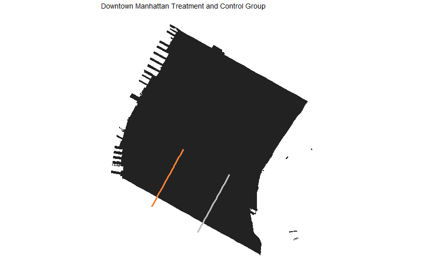
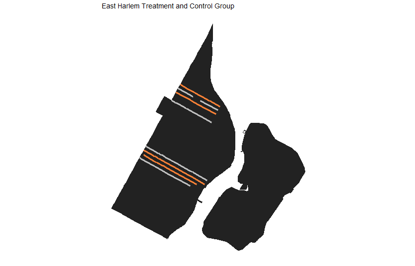

## Modeling

 

Q:
1)Modeling strategy  
2)What is your plan for generalizability

### Treatment and Control Groups

**Lower Manhattan**  
*Motivation*: 7th Avenue was the longest addition of new protected bikelane in 2018. 
3rd Avenue was chosen as the control because it was the only avenue without a bike lane in this area in 2018.
|Group Type|Street|Street Direction|Bike Lane Type|Date Added|Pre Period|Post Period|
|----------|------|----------------|--------------|----------|----------|-----------|
|Treatment|7th Avenue|Southbound|Protected|June 31 2018|May & June 2018|July & August 2018|
|Control|3rd Avenue|Northbound|No Bike Lane|

**East Harlem**  
*Motivation*: Four streets in East Harlem all got new bike lanes in 2018. This area is lower density than Chelsea and may generalize better to the rest of NYC. Control streets are other side streets in the neighborhood. 
|Group Type|Street|Street Direction|Bike Lane Type|Date Added|Pre Period|Post Period|
|----------|------|----------------|--------------|----------|----------|-----------|
|Treatment|E 128th St|Eastbound|Unprotected|Sep 31 2018|Aug & Sep 2018|Oct & Nov 2018|
|Treatment|E 126th St|Westbound|Unrpotected|Sep 31 2018|Aug & Sep 2018|Oct & Nov 2018|
|Treatment|E 110th St|Eastbound|Unrpotected|Sep 31 2018|Aug & Sep 2018|Oct & Nov 2018|
|Treatment|E 111th St|Westbound|Unrpotected|Sep 31 2018|Aug & Sep 2018|Oct & Nov 2018|
|Control|E 109th St|Westbound|No Bike Lane|
|Control|E 112th St|Eastbound|No Bike Lane|
|Control|E 127th St|Westbound|No Bike Lane|
|Control|E 124th St|Eastbound|No Bike Lane|

### Difference in Difference

 

#### East Harlem

|         | Pre   |  Post   |   Difference  |
|---------|------:|--------:|--------------:|
|Treatment|  325  |    405  |            	80|
|Control  |  309  |    307  |            -2 |
|Difference|	-16 |     -98 |            -82|

#### Lower Manhattan

|         | Pre   |  Post   |   Difference  |
|---------|------:|--------:|--------------:|
|Treatment|  4729  |    7046  |            	2317|
|Control  |  1809  |    2679  |              870|
|Difference|	2920 |     4367 |             1447|
