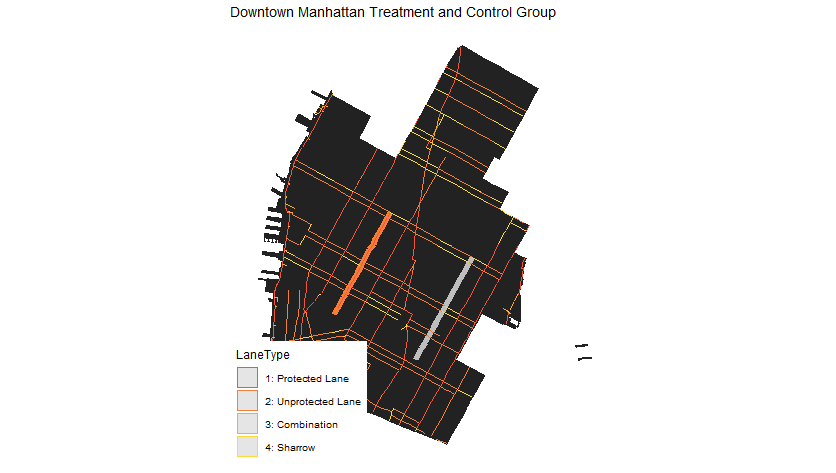
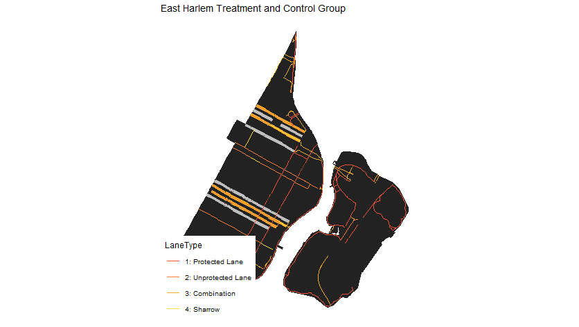

## Modeling

<br>

Q:
1)Modeling strategy <br>
2)What is your plan for generalizability

### Treatment and Control Groups

**Lower Manhattan** <br>
*Motivation*: 7th Avenue was the longest addition of new protected bikelane in 2018. 
3rd Avenue was chosen as the control because it was the only avenue without a bike lane in this area in 2018.
|Group Type|Street|Street Direction|Bike Lane Type|Date Added|Pre Period|Post Period|
|----------|------|----------------|--------------|----------|----------|-----------|
|Treatment|7th Avenue|Southbound|Protected|June 31 2018|May & June 2018|July & August 2018|
|Control|3rd Avenue|Northbound|No Bike Lane|



**East Harlem** <br>
*Motivation*: Four streets in East Harlem all got new bike lanes in 2018. This area is lower density than Chelsea and may generalize better to the rest of NYC. Control streets are other side streets in the neighborhood. 
|Group Type|Street|Street Direction|Bike Lane Type|Date Added|Pre Period|Post Period|
|----------|------|----------------|--------------|----------|----------|-----------|
|Treatment|E 128th St|Eastbound|Unprotected|Sep 31 2018|Aug & Sep 2018|Oct & Nov 2018|
|Treatment|E 126th St|Westbound|Unrpotected|Sep 31 2018|Aug & Sep 2018|Oct & Nov 2018|
|Treatment|E 110th St|Eastbound|Unrpotected|Sep 31 2018|Aug & Sep 2018|Oct & Nov 2018|
|Treatment|E 111th St|Westbound|Unrpotected|Sep 31 2018|Aug & Sep 2018|Oct & Nov 2018|
|Control|E 109th St|Westbound|No Bike Lane|
|Control|E 112th St|Eastbound|No Bike Lane|
|Control|E 127th St|Westbound|No Bike Lane|
|Control|E 124th St|Eastbound|No Bike Lane|



### Difference in Difference

<br>

#### East Harlem


|         | Pre   |  Post   |   Difference  |
|---------|------:|--------:|--------------:|
|Treatment|  325  |    405  |            	80|
|Control  |  309  |    307  |            -2 |
|Difference|	-16 |     -98 |            -82|


#### Lower Manhattan


|         | Pre   |  Post   |   Difference  |
|---------|------:|--------:|--------------:|
|Treatment|  4729  |    7046  |            	2317|
|Control  |  1809  |    2679  |              870|
|Difference|	2920 |     4367 |             1447|


<br>
<br>

### Difference in Difference over year


#### East Harlem

Using Sep18 and Sep19 as comparison:


|         | Pre   |  Post   |   Difference  |
|---------|------:|--------:|--------------:|
|Treatment|  178  |    332  |            154|
|Control  |  152  |    407  |            255|
|Difference|	-26 |      75 |            101|

<br>


### Coefficients between the number of trips and whether there is a bikelanes

<br>

Steps:

<br>
1)Aggregate monthly trip data into one
<br>
2)Slice the aggregated data into borough: Manhattan, Bronx, Brooklyn, Queens, Staten Island
<br>
3)We create a new feature called bikeland. Also, **we assume that if the bike track intersects with the bikelanes(15-feet buffer), the bike trip passes through/uses/is benefited from the bikelanes**. Additionally, we only use <b>protected bikelanes<b> and <b>unprotected bikelanes</b>. Therefore, if the bike track intersect with bikelanes, the value of column bikelane will be "yes", and vise versa.
<br>
<br>

```r
March2July_M <- March2July_M %>%
  mutate(bikelane = ifelse(id %in% M_inbike$id, "yes", "no"))
```

<br>

#### March to December, 2018

<br>

**Manhattan**

<br>

```r
reg_M <- lm(Count ~ bikeline, data=info.y18_M)
```

<br>


<table style="text-align:center"><caption><strong>Regression results</strong></caption>
<tr><td colspan="2" style="border-bottom: 1px solid black"></td></tr><tr><td style="text-align:left"></td><td><em>Dependent variable:</em></td></tr>
<tr><td></td><td colspan="1" style="border-bottom: 1px solid black"></td></tr>
<tr><td style="text-align:left"></td><td>Count</td></tr>
<tr><td colspan="2" style="border-bottom: 1px solid black"></td></tr><tr><td style="text-align:left">bikelineyes</td><td>364.436<sup>***</sup> (9.270)</td></tr>
<tr><td style="text-align:left">Constant</td><td>222.147<sup>***</sup> (3.595)</td></tr>
<tr><td colspan="2" style="border-bottom: 1px solid black"></td></tr><tr><td style="text-align:left">Observations</td><td>25,613</td></tr>
<tr><td style="text-align:left">R<sup>2</sup></td><td>0.057</td></tr>
<tr><td style="text-align:left">Adjusted R<sup>2</sup></td><td>0.057</td></tr>
<tr><td style="text-align:left">Residual Std. Error</td><td>530.316 (df = 25611)</td></tr>
<tr><td style="text-align:left">F Statistic</td><td>1,545.528<sup>***</sup> (df = 1; 25611)</td></tr>
<tr><td colspan="2" style="border-bottom: 1px solid black"></td></tr><tr><td style="text-align:left"><em>Note:</em></td><td style="text-align:right"><sup>*</sup>p<0.1; <sup>**</sup>p<0.05; <sup>***</sup>p<0.01</td></tr>
</table>
<br>
<br>
<br>

**Bronx**

<br>

```r
reg_Br <- lm(Count ~ bikeline, data=info.y18_Br)
```

<br>
<table style="text-align:center"><caption><strong>Regression results</strong></caption>
<tr><td colspan="2" style="border-bottom: 1px solid black"></td></tr><tr><td style="text-align:left"></td><td><em>Dependent variable:</em></td></tr>
<tr><td></td><td colspan="1" style="border-bottom: 1px solid black"></td></tr>
<tr><td style="text-align:left"></td><td>Count</td></tr>
<tr><td colspan="2" style="border-bottom: 1px solid black"></td></tr><tr><td style="text-align:left">bikelineyes</td><td>0.013 (0.084)</td></tr>
<tr><td style="text-align:left">Constant</td><td>1.555<sup>***</sup> (0.024)</td></tr>
<tr><td colspan="2" style="border-bottom: 1px solid black"></td></tr><tr><td style="text-align:left">Observations</td><td>3,147</td></tr>
<tr><td style="text-align:left">R<sup>2</sup></td><td>0.00001</td></tr>
<tr><td style="text-align:left">Adjusted R<sup>2</sup></td><td>-0.0003</td></tr>
<tr><td style="text-align:left">Residual Std. Error</td><td>1.280 (df = 3145)</td></tr>
<tr><td style="text-align:left">F Statistic</td><td>0.023 (df = 1; 3145)</td></tr>
<tr><td colspan="2" style="border-bottom: 1px solid black"></td></tr><tr><td style="text-align:left"><em>Note:</em></td><td style="text-align:right"><sup>*</sup>p<0.1; <sup>**</sup>p<0.05; <sup>***</sup>p<0.01</td></tr>
</table>


<br>
<br>
<br>

**Queens**

<br>

```r
reg_Q <- lm(Count ~ bikeline, data=info.y18_Q)
```

<br>
<br>


<table style="text-align:center"><caption><strong>Regression results</strong></caption>
<tr><td colspan="2" style="border-bottom: 1px solid black"></td></tr><tr><td style="text-align:left"></td><td><em>Dependent variable:</em></td></tr>
<tr><td></td><td colspan="1" style="border-bottom: 1px solid black"></td></tr>
<tr><td style="text-align:left"></td><td>Count</td></tr>
<tr><td colspan="2" style="border-bottom: 1px solid black"></td></tr><tr><td style="text-align:left">bikelineyes</td><td>91.995<sup>***</sup> (5.631)</td></tr>
<tr><td style="text-align:left">Constant</td><td>35.938<sup>***</sup> (1.540)</td></tr>
<tr><td colspan="2" style="border-bottom: 1px solid black"></td></tr><tr><td style="text-align:left">Observations</td><td>7,630</td></tr>
<tr><td style="text-align:left">R<sup>2</sup></td><td>0.034</td></tr>
<tr><td style="text-align:left">Adjusted R<sup>2</sup></td><td>0.034</td></tr>
<tr><td style="text-align:left">Residual Std. Error</td><td>129.424 (df = 7628)</td></tr>
<tr><td style="text-align:left">F Statistic</td><td>266.905<sup>***</sup> (df = 1; 7628)</td></tr>
<tr><td colspan="2" style="border-bottom: 1px solid black"></td></tr><tr><td style="text-align:left"><em>Note:</em></td><td style="text-align:right"><sup>*</sup>p<0.1; <sup>**</sup>p<0.05; <sup>***</sup>p<0.01</td></tr>
</table>


<br>
<br>
<br>


**Brooklyn**

<br>

```r
reg_Bk <- lm(Count ~ bikeline, data=info.y18_Bk)
```

<br>


<table style="text-align:center"><caption><strong>Regression results</strong></caption>
<tr><td colspan="2" style="border-bottom: 1px solid black"></td></tr><tr><td style="text-align:left"></td><td><em>Dependent variable:</em></td></tr>
<tr><td></td><td colspan="1" style="border-bottom: 1px solid black"></td></tr>
<tr><td style="text-align:left"></td><td>Count</td></tr>
<tr><td colspan="2" style="border-bottom: 1px solid black"></td></tr><tr><td style="text-align:left">bikelineyes</td><td>209.166<sup>***</sup> (4.894)</td></tr>
<tr><td style="text-align:left">Constant</td><td>62.276<sup>***</sup> (1.802)</td></tr>
<tr><td colspan="2" style="border-bottom: 1px solid black"></td></tr><tr><td style="text-align:left">Observations</td><td>18,149</td></tr>
<tr><td style="text-align:left">R<sup>2</sup></td><td>0.091</td></tr>
<tr><td style="text-align:left">Adjusted R<sup>2</sup></td><td>0.091</td></tr>
<tr><td style="text-align:left">Residual Std. Error</td><td>225.692 (df = 18147)</td></tr>
<tr><td style="text-align:left">F Statistic</td><td>1,826.534<sup>***</sup> (df = 1; 18147)</td></tr>
<tr><td colspan="2" style="border-bottom: 1px solid black"></td></tr><tr><td style="text-align:left"><em>Note:</em></td><td style="text-align:right"><sup>*</sup>p<0.1; <sup>**</sup>p<0.05; <sup>***</sup>p<0.01</td></tr>
</table>


<br>
<br>
<br>


**Staten Island**

<br>

```r
reg_S <- lm(Count ~ bikeline, data=info.y18_S)
```

<br>

<table style="text-align:center"><caption><strong>Regression results</strong></caption>
<tr><td colspan="2" style="border-bottom: 1px solid black"></td></tr><tr><td style="text-align:left"></td><td><em>Dependent variable:</em></td></tr>
<tr><td></td><td colspan="1" style="border-bottom: 1px solid black"></td></tr>
<tr><td style="text-align:left"></td><td>Count</td></tr>
<tr><td colspan="2" style="border-bottom: 1px solid black"></td></tr><tr><td style="text-align:left">bikelineyes</td><td>-0.023 (0.045)</td></tr>
<tr><td style="text-align:left">Constant</td><td>1.023<sup>***</sup> (0.009)</td></tr>
<tr><td colspan="2" style="border-bottom: 1px solid black"></td></tr><tr><td style="text-align:left">Observations</td><td>277</td></tr>
<tr><td style="text-align:left">R<sup>2</sup></td><td>0.001</td></tr>
<tr><td style="text-align:left">Adjusted R<sup>2</sup></td><td>-0.003</td></tr>
<tr><td style="text-align:left">Residual Std. Error</td><td>0.146 (df = 275)</td></tr>
<tr><td style="text-align:left">F Statistic</td><td>0.252 (df = 1; 275)</td></tr>
<tr><td colspan="2" style="border-bottom: 1px solid black"></td></tr><tr><td style="text-align:left"><em>Note:</em></td><td style="text-align:right"><sup>*</sup>p<0.1; <sup>**</sup>p<0.05; <sup>***</sup>p<0.01</td></tr>
</table>


<br>
<br>
<br>


### Feature Engineering and Models

<br>

The following table is a sample that demonstrates how our data look like when we are running models.


<br>

#### Features
<ul>
  <li>Whether the road is bikelane or not</li>
  <li>Whether the road is protected bikelane</li>
  <li>Whether the road is unprotected bikelane</li>
  <li>Distance to closest bikelanes</li>
  <li>The number of trips of the 1st closest bikelane</li>
  <li>The number of trips of the 2nd closest bikelane</li>
  <li>The number of trips of the 3rd closest bikelane</li>
  <li>The number of bike trips in each neighborhood</li>
  <li>The sum of the number of trips in the 1st and 2nd cloest roads</li>
</ul>


<br>
<br>

#### Result

<br>
<br>

<table style="text-align:center"><caption><strong>Regression results</strong></caption>
<tr><td colspan="2" style="border-bottom: 1px solid black"></td></tr><tr><td style="text-align:left"></td><td><em>Dependent variable:</em></td></tr>
<tr><td></td><td colspan="1" style="border-bottom: 1px solid black"></td></tr>
<tr><td style="text-align:left"></td><td>Count</td></tr>
<tr><td colspan="2" style="border-bottom: 1px solid black"></td></tr><tr><td style="text-align:left">bikelineyes</td><td>0.078 (1.274)</td></tr>
<tr><td style="text-align:left">dist.lane</td><td>0.0001<sup>*</sup> (0.0001)</td></tr>
<tr><td style="text-align:left">protectedyes</td><td>0.979 (1.276)</td></tr>
<tr><td style="text-align:left">unprotectedyes</td><td>0.036 (1.276)</td></tr>
<tr><td style="text-align:left">n1Count</td><td>0.010<sup>***</sup> (0.001)</td></tr>
<tr><td style="text-align:left">n2Count</td><td>-0.014<sup>***</sup> (0.001)</td></tr>
<tr><td style="text-align:left">n3Count</td><td>0.002 (0.001)</td></tr>
<tr><td style="text-align:left">nhCount</td><td>-0.00001<sup>*</sup> (0.00000)</td></tr>
<tr><td style="text-align:left">C2</td><td>0.502<sup>***</sup> (0.001)</td></tr>
<tr><td style="text-align:left">Constant</td><td>-0.120<sup>**</sup> (0.061)</td></tr>
<tr><td colspan="2" style="border-bottom: 1px solid black"></td></tr><tr><td style="text-align:left">Observations</td><td>45,269</td></tr>
<tr><td style="text-align:left">R<sup>2</sup></td><td>0.916</td></tr>
<tr><td style="text-align:left">Adjusted R<sup>2</sup></td><td>0.916</td></tr>
<tr><td style="text-align:left">Residual Std. Error</td><td>6.234 (df = 45259)</td></tr>
<tr><td style="text-align:left">F Statistic</td><td>54,953.430<sup>***</sup> (df = 9; 45259)</td></tr>
<tr><td colspan="2" style="border-bottom: 1px solid black"></td></tr><tr><td style="text-align:left"><em>Note:</em></td><td style="text-align:right"><sup>*</sup>p<0.1; <sup>**</sup>p<0.05; <sup>***</sup>p<0.01</td></tr>
</table>
