NYCDOT
================
Jiaxuan Lyu, Kate Sutton, Xintian Stella Li
1/31/2021

## Set up the boxr api

``` r
#box_auth(client_id = "nnlfdm85tbwa6vb5tgauczwed3rciavx", 
#        client_secret = "S8B3zjkOm7xipOb0JZjgX5gu1i9tnPfo")
```

Note that the `echo = FALSE` parameter was added to the code chunk to
prevent printing of the R code that generated the plot.

\#Visualization

``` r
library(tidyverse)
library(sf)
library(lubridate)
library(RSocrata)
```

    ## Warning: package 'RSocrata' was built under R version 4.0.3

\#Used 2018 ride data in April

    ## Reading layer `ride2018Apr_sf' from data source `C:\Users\katee\Box Sync\Practicum\shp\ride2018Apr\ride2018Apr_sf.shp' using driver `ESRI Shapefile'
    ## Simple feature collection with 32374 features and 6 fields
    ## geometry type:  LINESTRING
    ## dimension:      XY
    ## bbox:           xmin: -122.0299 ymin: -23.54286 xmax: 139.6987 ymax: 45.50632
    ## geographic CRS: WGS 84

    ## Reading layer `bikelane_17d' from data source `C:\Users\katee\Box Sync\Practicum\shp\bikelane_17d.shp' using driver `ESRI Shapefile'
    ## Simple feature collection with 19478 features and 118 fields
    ## geometry type:  LINESTRING
    ## dimension:      XY
    ## bbox:           xmin: 914209.9 ymin: 120826.2 xmax: 1066709 ymax: 271349.1
    ## projected CRS:  NAD83 / New York Long Island (ftUS)

    ## Reading layer `bikelane_18d' from data source `C:\Users\katee\Box Sync\Practicum\shp\bikelane_18d.shp' using driver `ESRI Shapefile'
    ## Simple feature collection with 20466 features and 118 fields
    ## geometry type:  LINESTRING
    ## dimension:      XY
    ## bbox:           xmin: 914209.9 ymin: 120826.2 xmax: 1066709 ymax: 271349.1
    ## projected CRS:  NAD83 / New York Long Island (ftUS)

    ## Reading layer `bikelane_19d' from data source `C:\Users\katee\Box Sync\Practicum\shp\bikelane_19d.shp' using driver `ESRI Shapefile'
    ## Simple feature collection with 20636 features and 118 fields
    ## geometry type:  LINESTRING
    ## dimension:      XY
    ## bbox:           xmin: 914209.9 ymin: 120826.2 xmax: 1066709 ymax: 271349.1
    ## projected CRS:  NAD83 / New York Long Island (ftUS)

    ## Reading layer `bikelane_20d' from data source `C:\Users\katee\Box Sync\Practicum\shp\bikelane_20d.shp' using driver `ESRI Shapefile'
    ## Simple feature collection with 23285 features and 121 fields
    ## geometry type:  LINESTRING
    ## dimension:      XY
    ## bbox:           xmin: 914209.9 ymin: 120826.2 xmax: 1066709 ymax: 271349.1
    ## projected CRS:  NAD83 / New York Long Island (ftUS)

    ## Reading layer `7t3b-ywvw' from data source `https://data.cityofnewyork.us/resource/7t3b-ywvw.geojson' using driver `GeoJSON'
    ## Simple feature collection with 5 features and 4 fields
    ## geometry type:  MULTIPOLYGON
    ## dimension:      XY
    ## bbox:           xmin: -74.25559 ymin: 40.49612 xmax: -73.70001 ymax: 40.91553
    ## geographic CRS: WGS 84

    ## Reading layer `geo_export_8469ffba-1951-4e52-916c-c9c4dfa54c18' from data source `C:\Users\katee\Box Sync\Practicum\shp\for_basemap\geo_export_8469ffba-1951-4e52-916c-c9c4dfa54c18.shp' using driver `ESRI Shapefile'
    ## Simple feature collection with 2023 features and 35 fields
    ## geometry type:  MULTIPOLYGON
    ## dimension:      XY
    ## bbox:           xmin: -74.25609 ymin: 40.49449 xmax: -73.70905 ymax: 40.91133
    ## geographic CRS: WGS84(DD)

    ## Reading layer `OPEN_SPACE_NO_PARK' from data source `C:\Users\katee\Box Sync\Practicum\shp\for_basemap\OPEN_SPACE_NO_PARK.shp' using driver `ESRI Shapefile'
    ## Simple feature collection with 4191 features and 7 fields
    ## geometry type:  POLYGON
    ## dimension:      XY
    ## bbox:           xmin: 916230.9 ymin: 121640.5 xmax: 1066911 ymax: 272379.5
    ## projected CRS:  NAD83 / New York Long Island (ftUS)

    ## Joining, by = c("Street", "LBoro", "SegmentID", "SHAPE_Leng", "BikeLane", "LaneType", "Borough")
    ## Joining, by = c("Street", "LBoro", "SegmentID", "SHAPE_Leng", "BikeLane", "LaneType", "Borough")
    ## Joining, by = c("Street", "LBoro", "SegmentID", "SHAPE_Leng", "BikeLane", "LaneType", "Borough")

    ## `summarise()` regrouping output by 'Borough' (override with `.groups` argument)

    ## `summarise()` ungrouping output (override with `.groups` argument)
    ## `summarise()` ungrouping output (override with `.groups` argument)
    ## `summarise()` ungrouping output (override with `.groups` argument)

``` r
#trips by days
ggplot()+
  geom_sf(data = rideApr) +
  facet_wrap(~days)
```

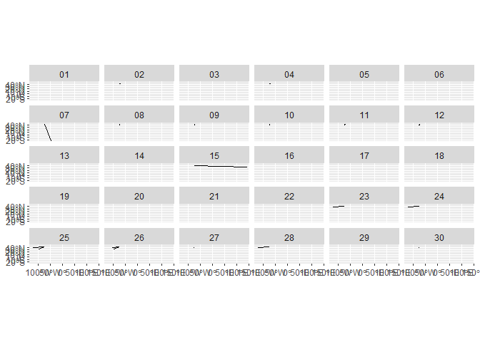<!-- -->

``` r
#trips by hours in one day
ggplot()+
  geom_sf(data = rideApr %>%
            filter(days == "01")) +
  facet_wrap(~rhour)
```

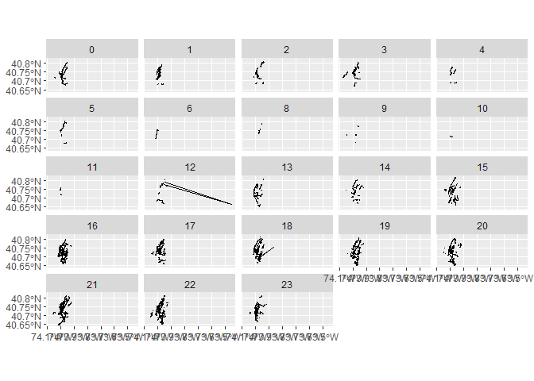<!-- -->

``` r
#change days as numeric
rideApr$days <- as.numeric(rideApr$days)

#trips over days
ggplot(rideApr %>%
       as.data.frame() %>%
       group_by(days) %>%
       tally())+
  geom_line(aes(x = days, y = n))
```

<!-- -->

``` r
#trips over hour
ggplot(rideApr %>%
         as.data.frame() %>%
         group_by(rhour) %>%
         tally())+
  geom_line(aes(x = rhour, y = n))
```

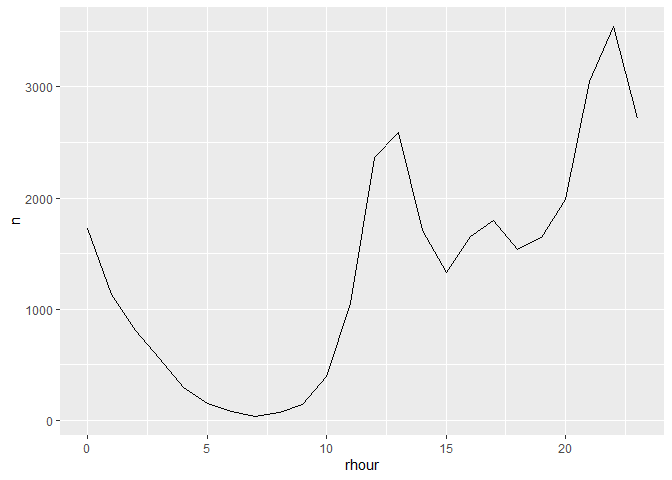<!-- -->

# Bike Lanes Over Time 2018-2021

### darker is newer

``` r
ggplot()+
  geom_sf(data=boroughs, color='white', fill='white')+
  geom_sf(data=big_parks, color='#c4d9ab', fill='#d5e8be')+
  geom_sf(data=big_open,color='#c4d9ab', fill='#d5e8be')+
  geom_sf(data=bikelane_20d, color='blue')+
  geom_sf(data=bikelane_19d, color = 'red')+
  geom_sf(data=bikelane_18d, color='#1cd9ff')+
  geom_sf(data=bikelane_17d, color = 'azure4')
```

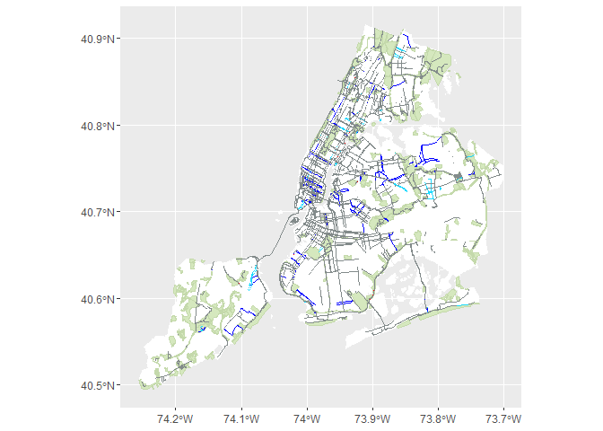<!-- -->

# Bike Lanes by Level of Protection

### darker is more protected

``` r
ggplot()+
  geom_sf(data=boroughs, color='white', fill='white')+
  geom_sf(data=big_parks, color='#c4d9ab', fill='#d5e8be')+
  geom_sf(data=big_open,color='#c4d9ab', fill='#d5e8be')+
  geom_sf(data=protected_20d, color='#6a51a3')+
  geom_sf(data=unprotected_20d, color='#9e9ac8')+
  geom_sf(data=sharrow_20d, color='#d3d1e8')
```

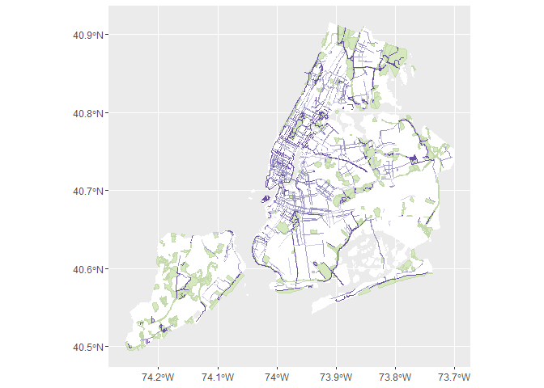<!-- -->

# Bike Lane Plots

``` r
ggplot(data=group_20_boro)+
  geom_col(aes(x=Borough, y=Length))+
  labs(title='NYC Bike Lanes by Borough - 2021')
```

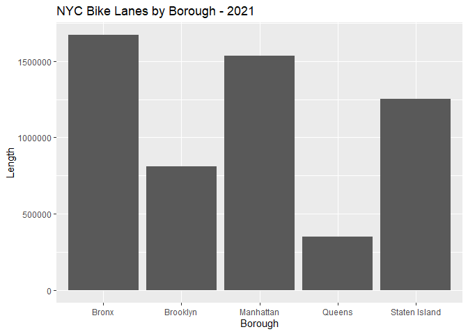<!-- -->

``` r
ggplot(data=group_20_boro)+
  geom_col(aes(x=LaneType, y=Length))+
  labs(title='NYC Bike Lanes by Type - 2021')
```

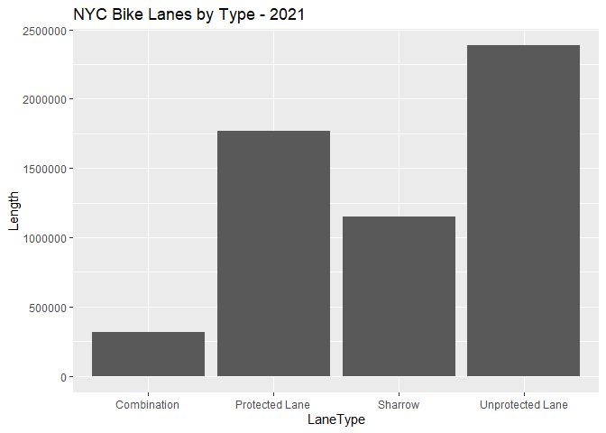<!-- -->

``` r
ggplot(data=group_20_boro)+
  geom_col(aes(x=Borough, y=Length, fill=LaneType), position='dodge')+
  labs(title='NYC Bike Lanes by Borough and Type - 2021')
```

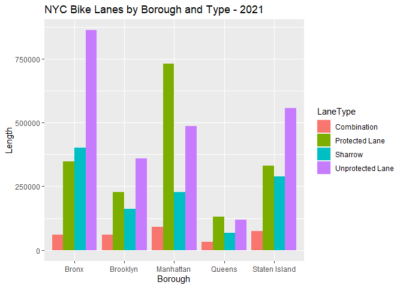<!-- -->

``` r
ggplot(data=new_18_group)+
  geom_col(aes(x=Borough, y=Length, fill=LaneType), position='dodge')+
  labs(title='Bike Lanes Built in 2018')
```

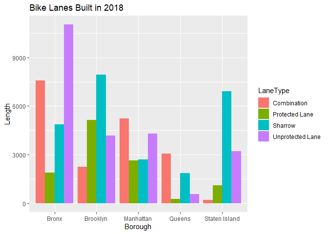<!-- -->

``` r
ggplot(data=new_19_group)+
  geom_col(aes(x=Borough, y=Length, fill=LaneType), position='dodge')+
  labs(title='Bike Lanes Built in 2019')
```

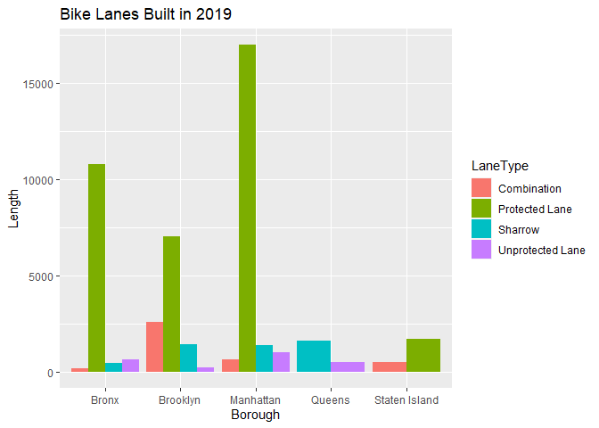<!-- -->

``` r
ggplot(data=new_20_group)+
  geom_col(aes(x=Borough, y=Length, fill=LaneType), position='dodge')+
  labs(title='Bike Lanes Built in 2020')
```

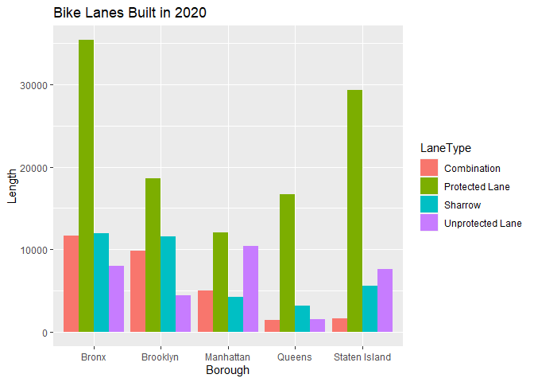<!-- -->
