```{r setup, include=FALSE}
knitr::opts_chunk$set(echo = FALSE)

load("C:/Users/katee/Box Sync/Practicum/shp/forMarkdown3.RData")

library(sf)
library(tidyverse)
library(mapview)
library(kableExtra)
library(viridis)
library(gridExtra)
library(ggcorrplot)


mapTheme <- theme(plot.title =element_text(size=16),
                  plot.subtitle = element_text(size=13),
                  plot.caption = element_text(size = 10),
                  axis.line=element_blank(),
                  axis.text.x=element_blank(),
                  axis.text.y=element_blank(),
                  axis.ticks=element_blank(),
                  axis.title.x=element_blank(),
                  axis.title.y=element_blank(),
                  panel.background=element_blank(),
                  panel.border=element_blank(),
                  panel.grid.major=element_line(colour = 'transparent'),
                  panel.grid.minor=element_blank(),
                  legend.direction = "vertical", 
                  legend.position = "right",
                  plot.margin = margin(1, 1, 1, 1, 'cm'),
                  legend.key.height = unit(1, "cm"), legend.key.width = unit(0.2, "cm"))


#for difference in difference tables
lowerMH_results <- data.frame(Type = c('Treatment', 'Control', 'Difference'),
                         Pre = c(3786, 1713, 2073),
                         Post = c(8397, 2903, 5494),
                         Difference = c(4611, 1190, 3421))

eHarlem_results <- data.frame(Type = c('Treatment', 'Control', 'Difference'),
                              Pre = c(178, 152, 26),
                              Post = c(332, 407, -75),
                              Difference = c(154, 255, -101))

#setup for correlation plots
correlation.long_t <-
  select(st_drop_geometry(line.Aug), c(Number_Tra, POSTED_SPE, StreetWidt,
                                       citibike.Buffer_small,
                                       dist.lane,
                                       Count)) %>%
  gather(Variable, Value, -Count)

correlation.cor_t <-
  correlation.long_t %>%
  group_by(Variable) %>%
  summarize(correlation = cor(Value, Count, use = "complete.obs"))

correlation.long_c <-
  select(st_drop_geometry(line.Aug), c(pWhite, pSubw,
                                       pNoVeh, MedRent, Count)) %>%
  gather(Variable, Value, -Count)

correlation.cor_c <-
  correlation.long_c %>%
  group_by(Variable) %>%
  summarize(correlation = cor(Value, Count, use = "complete.obs"))

correlation.long_a <-
  select(st_drop_geometry(info.Aug), c(sidewalk_caf_nn3, subway_nn5, jobs_in_tract, 
                                       density_retail, density_office, 
                                       Count)) %>%
  gather(Variable, Value, -Count)

correlation.cor_a <-
  correlation.long_a %>%
  group_by(Variable) %>%
  summarize(correlation = cor(Value, Count, use = "complete.obs"))

#multicollinearity plot
numericVars <- line.Aug%>%
  select(dist.lane, Number_Tra, StreetWidt, citibike.Buffer_small,
         pWhite, MedRent, pNoVeh, pSubw, sidewalk_caf_nn3, subw_nn5,
         jobs_in_tract, densi_retail, densi_office)%>%
  st_set_geometry(NULL)%>%
  na.omit()

corr<-round(cor(numericVars), 1)
p.mat<- cor_pmat(numericVars)


```
<center>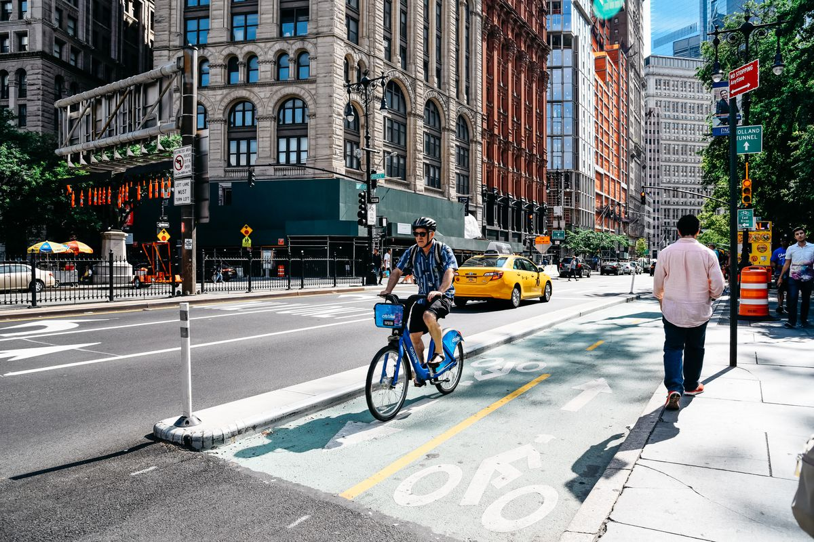{width=80%}</center>

# 1. Introduction
## 1.1 About this Project
This project developed a method of **predicting bikeshare trips** in New York City with emphasis on the effect of **bicycle infrastructure**, such as bike lanes. We used our modeling predictions to explore bike planning scenarios in New York City. This project is one of the first to use data capturing the *unique routes taken by each bikeshare trip*, so the methods used herein could be applied to other similar datasets. This document will outline the motivation for our project, exploratory analysis, feature engineering and model building, and the scenario planning tool displayed in our application. 

This project was completed for the final capstone in the **Master of Urban Spatial Analytics** program at the **University of Pennsylvania**. We are very thankful to our instructors, Ken Steif, Michael Fichman, and Matt Harris, for their insight and patient guidance as we undertook this large task. We are also incredibly grateful and indebted to our clients, Kyle Yakal-Kremski, Apaar Bansal, and Paula Rubira from the **New York City Department of Transportation**, for their generosity in sharing such a unique dataset with a group of students and working with us through this process.

## 1.2 Motivation 
<center>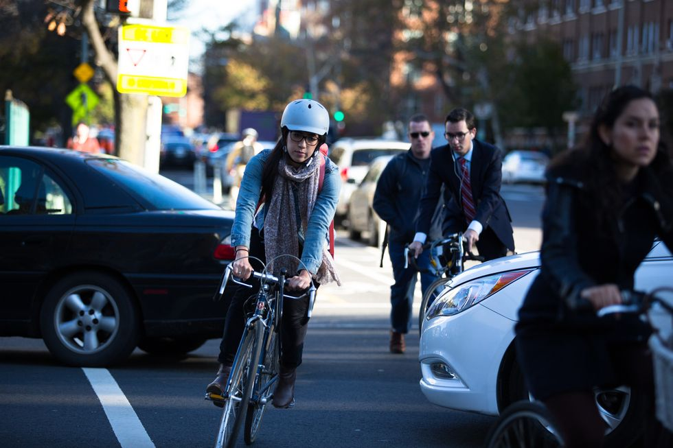{width=60%}</center>

<br>
Riding a bike in a city can be a harrowing task of dodging turning vehicles, weaving around parked cars and delivery trucks, and watching out for a car door that may open any moment. **Bike lanes** are an important way to carve out space for cyclists to improve the comfort and safety of riding. However, it can be a very challenging task to build broad support for bike lanes and **decide which streets should receive bike lanes** first. Our project provides a new way of predicting the impact of a bike lane based on unique ridership data from the *Citibike* system in New York City, in which people rent bikes from docked stations.

## 1.3 Use Case
A transportation planner’s task of **deciding where to install a new bike lane** is a challenging one. Planners must create a network throughout the city that allows cyclists to flow between destinations and protects them from the dangers of the road. Planners may **prioritize streets for bike lane investments** based on the number of collisions between cars and cyclists or the value of a certain road to the network. There are also strategic factors, such as a street repaving, that can present a convenient time for lane reconfiguration. It is also crucial to develop relationships in communities where new bike lanes will be installed to build support for the changes and ensure community members know how to use the new cycling infrastructure.

<br>

<center>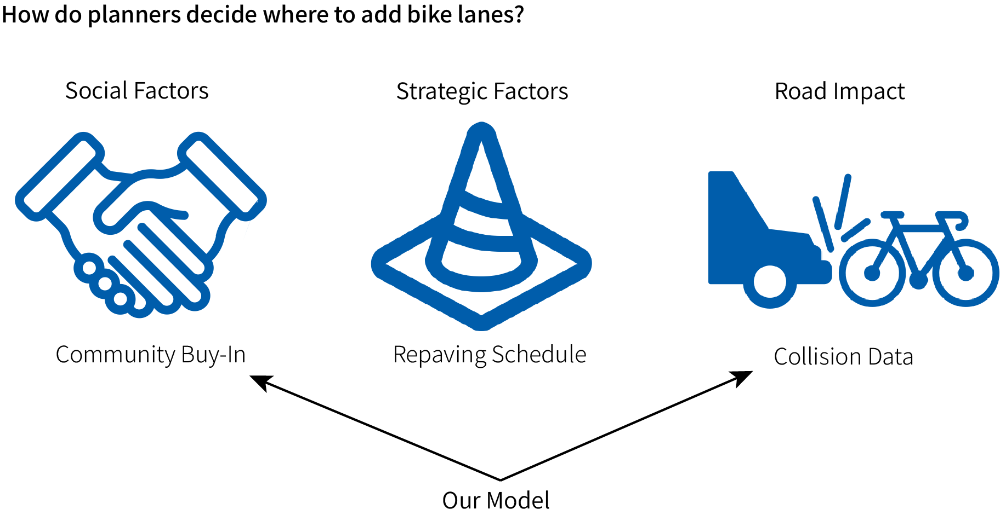{width=80%}</center>
<br>

This project provides a unique way of prioritizing streets for bike lane investments *based on observed bikeshare ridership*. Predicting the impact of a new bikelane on bike ridership for would give our client, the NYC DOT, an additional tool to use in deciding which streets to prioritize for bike lanes. Furthermore, if planners can explain to a community board the most important streets for adding a bike lane or quantify the impact of adding a more protected facility, it could help advocate for the most needed changes or develop relationships with groups who are more skeptical of bike lanes.

# 2. Data
## 2.1 Sources
To develop this model, we relied on two main data sources. New York City’s street centerlines dataset shows the type of bike lane on any given street and where the bike lane network has expanded over time. We combined this with trip data from the bikeshare system, Citibike, in which people can rent bikes at docked stations.
To predict bikeshare ridership, we relied on additional data sources including American Community Survey 2015-2019 Estimates, Open Street Map amenity data, and additional amenity datasets from New York City Open Data. 

Dataset | Source
--------|-------
Citibike Trips | NYC Department of Transportation
LION Street Centerlines | Bytes of the Big Apple Archive
Citibike Stations | NYC Department of Transportation
Demographics | American Community Survey 2015-2019 Estimates
Job Locations | Longitudinal Employer HOusehold Dynamics
Ofice and Retail Amenities | OpenStreetMap
Additional Amenities | NYC Open Data

### Trip Data
This project is unique because it relies on a very uncommon type of trip data that is not usually shared with the public. Most publicly available data on docked bikeshare systems is origin-destination data, meaning you know the stations where a trip starts and ends but not the route the cyclist took in between. Since 2018, Citibike has allowed riders to opt-in to having their trip tracked via their phone’s GPS. The resulting data, rather than being a pair of stations, is a line that shows the exact route a rider took. This allows much greater insight into the choices cyclists make when they ride and allows us to calculate the ridership of bikeshare trips on any given block.

<br>
<center>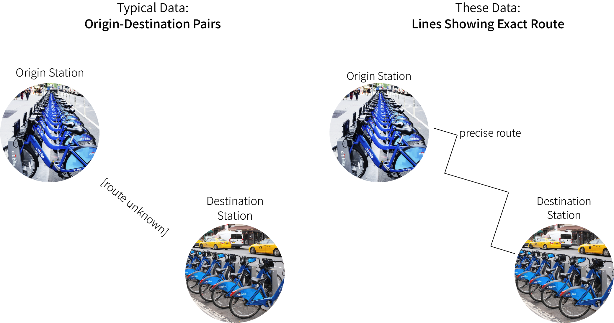{width=80%}</center>
<br>

### Types of Bike Lanes
New York City uses three categories for recording bike lanes, which we have termed **Protected Lanes**, **Unprotected Lanes**, and **Sharrows**. The highest level of protection recorded in the data is a protected lane, which is separated from vehicle lanes by parked cars or another kind of buffer to create a dedicated space for cyclists. An unprotected lane is one in which the bike lane is painted onto the street immediately adjacent to the vehicle lane. Even though this is a bike lane, it offers less protection because vehicles can easily wander into the bike lane. The final category, sharrow, is used when streets are not wide enough for separate vehicle and bike lanes. The term sharrow refers to the symbol of an arrow with a cycle and is meant to encourage drivers to share the lane with cyclists. Since the sharrow is very similar to a street without a bike lane, we decided to exclude it from our category of bike lane.

Protected Lane | Unprotected Lane | Sharrow
---------------|------------------|--------
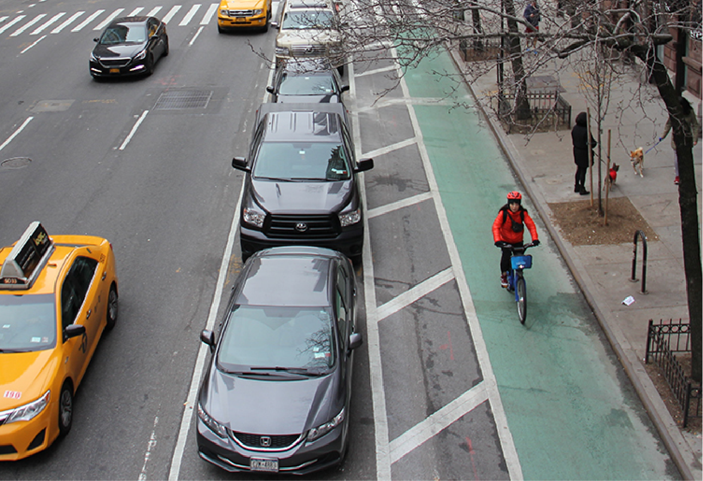{width=93%}||

### Study Area
Since the the Citibike network does not extend throughout all of New York, we defined a study area based on the time frame used by our predictive model: **August 2020**. We chose this month because it captures the warm weather of the summer and includes stations in the Bronx, which was only added to the Citibike network starting in July 2020. Our study area therefore comprises a **half mile buffer** around the **Citibike stations** that were available in August of 2020. This study area extends for most of Manhattan, and parts of the Bronx, Brooklyn, and Queens.


```{r, echo=FALSE, fig.width=10, fig.height=7}
ggplot()+
  #geom_sf(data=extent, fill=NA)+
  geom_sf(data=borough_sa, fill=NA)+
  geom_sf(data=station, alpha=0.5, color='#005dab', fill='#005dab', show.legend = 'point')+
  labs(title= 'Study Area', subtitle = 'Citibike Stations 1/2 mi Buffer', caption= 'August 2020 stations')+
  mapTheme
```

## 2.2 Data Cleaning
Converting individual bikeshare trips into useful ridership data is a very challenging task. Since this is such a **novel** analysis, recording our data cleaning process will be helpful to anyone pursuing a similar project in the future. The steps we pursued are as follows:

1. From NYC lion street centerlines, filter out non-bikeable streets (e.g. highways, tunnels, ferry routes)
2. Create a 15 foot buffer around street centerlines
3. Convert each line to points
4. Spatial join each point to one street segment buffer
5. Group by street segment and Trip ID to sum the number of trips per segment

<br>
<center>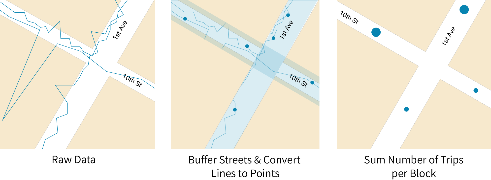{width=80%}</center>
<br>

#### Possible Improvements 
*Buffer Width* <br>
For ease of calculation, we chose a single buffer width of **15 feet**. When buffers for different street segments overlap, assigning each point to only one of those buffers is more time-consuming in R. Using a buffer of 15 feet allowed us to capture most points and **minimize overlap** between buffers. However, many streets are more than 30 feet wide, so this method could miss some ridership. Using a variable buffer width based on street width could improve this calculation in the future. 

*Lines to Points* <br>
The built-in tool in ArcMap to **Generate Points Along Lines** is meant to place a point along each line at a specified distance. However, we found that with a dataset of 100,000 trips, the resulting data was very **spatially inconsistent**, with large peaks of 300-400 riders while no other adjoining street had counts higher than 30 trips. This suggested to us that the initial ArcMap tool was not generating points in the way it had described. We performed a second points generation using a [**custom tool**](https://www.arcgis.com/home/item.html?id=a2a41c8345e24ab6a9dd2ae215710b39) from a [Stack Exchange post](https://gis.stackexchange.com/questions/41307/creating-point-file-along-line-trail-at-regular-distances-0-20-miles-using-a), which resulted in much **more spatially consistent** ridership counts. However, there are still some segments where the count on one segment is several hundred trips higher than any adjoining segment. Future analyses should investigate this step and find the optimal way to generate points along lines, either in ArcMap, ArcGIS Pro, or R. 

<center>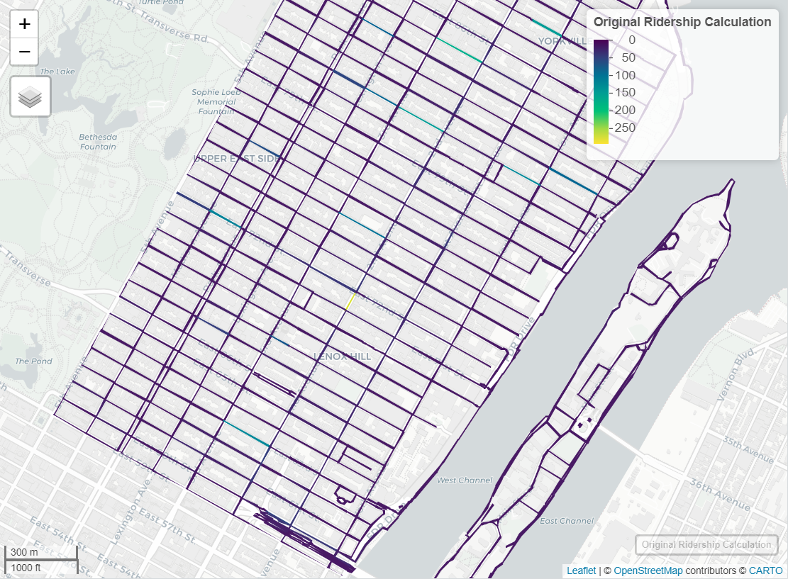{width=50%}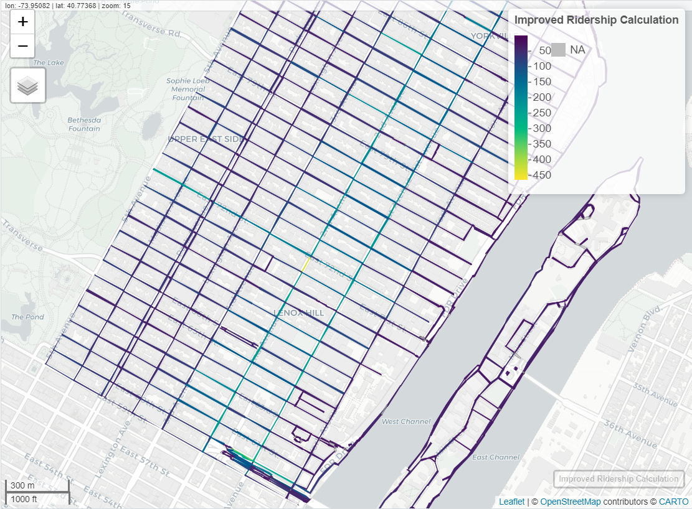{width=50%}</center>
**Figure 1.** Original (left) vs. improved (right) ridership counts. Original counts created using ArcMap Generate Points Along Lines. Improved counts created using custom toolbox, [Create Points from Lines](https://www.arcgis.com/home/item.html?id=a2a41c8345e24ab6a9dd2ae215710b39), created by another user. 


# 3. Explorary Analysis
Our exploratory analysis was motivated by two questions: 

* **What are the spatial trends in bikeshare ridership?**
* **Do bike lanes influence bikeshare ridership?**

## 3.1 Spatial Trends in Bikeshare Ridership
To explore the first question, we visualized ridership in several ways, the first being a distribution plot. 

```{r, echo=FALSE, fig.align='center'}
ggplot(line.Aug, aes(x=Count)) + 
  geom_histogram(binwidth=10,  fill='#005dab')+
  labs(x='Ridership', 
       y='Count',
       title='Ridership Distribution Plot',
       caption='Aug 1-14, 2020')

```

The distribution plot shows that the data are very left-skewed, with a high number of street segments having less than 10 trips and a long tail extending out to 1061 trips on a single segment.

### Ridership by Street Segment{.tabset}
The most basic way to map ridership is at the street segment level. Because the data has a long tail, restricting the range for plotting to 800, 300, and 50 trips can help visualize the full variation of the data. 

#### Up to 800 Trips
```{r, echo=FALSE, fig.height=6, fig.align='center'}
ggplot() +
  geom_sf(data = borough_sa, fill = "#eeeeee", color='#aaaaaa') +
  geom_sf(data = upto800, aes(colour =Count), size=1, alpha=0.9) +
  scale_colour_viridis(direction = -1, discrete = FALSE, option="viridis")+
  labs(title="Bikeshare Ridership by Street Segment",
       subtitle='Street Segments with Less Than 800 Trips',
       caption = 'Aug 1-14, 2020')+
  mapTheme

```

#### Up to 400 Trips
```{r, echo=FALSE, fig.height=6, fig.align='center'}
ggplot() +
  geom_sf(data = borough_sa, fill = "#eeeeee", color='#aaaaaa') +
  geom_sf(data = upto400, aes(colour =Count), size=1, alpha=0.9) +
  scale_colour_viridis(direction = -1, discrete = FALSE, option="viridis")+
  labs(title="Bikeshare Ridership by Street Segment",
       subtitle='Street Segments with Less Than 400 Trips',
       caption = 'Aug 1-14, 2020')+
  mapTheme

```

#### Up to 100 Trips
```{r, echo=FALSE, fig.height=6, fig.align='center'}
ggplot() +
  geom_sf(data = borough_sa, fill = "#eeeeee", color='#aaaaaa') +
  geom_sf(data = upto100, aes(colour =Count), size=1, alpha=0.9) +
  scale_colour_viridis(direction = -1, discrete = FALSE, option="viridis")+
  labs(title="Bikeshare Ridership by Street Segment",
       subtitle='Street Segments with Less Than 100 Trips',
       caption = 'Aug 1-14, 2020')+
  mapTheme

```


### High Median Segment Ridership
Since we summarized trips at the segment level, a good way to find streets with
high ridership is to look at the median segment ridership for each street. A high median segment ridership suggests that the street has high ridership on many segments, rather than only a few prominent blocks. 

#### Manhattan{.tabset}

##### Map
```{r, echo=FALSE, fig.height=6, fig.align='center'}
mh_map<- ggplot() +
  geom_sf(data = mh, fill = "#eeeeee", color='#aaaaaa') +
  geom_sf(data = mh_streetMap, aes(color =MedianCount,), size=1.1, alpha=1) +
  scale_colour_viridis(direction = -1, discrete = FALSE, option="viridis")+
  labs(title="Median Segment Ridership by Street",
       subtitle = 'Top 100 Streets in Manhattan',
       caption= 'Aug 1-14, 2020')+
  mapTheme
mh_map
```

In looking at Manhattan ridership, it is clear that the loop in Central Park, shown as West Drive and East Drive in the table, has very high median segment ridership. Other streets with high ridership include the Hudson River Greenway on the West side and the Williamsburg Bridge bike path. Most of the streets with high median segment ridership are concentrated south of Central Park. 

##### Table
```{r, echo=FALSE}
mh_table<- mh_streetTable%>%
  arrange(desc(MedianCount))%>%
  kbl(caption='Top 100 Streets in Manhattan by Median Segment Ridership')%>%
  kable_styling(bootstrap_options = c('striped', 'hover'))%>%
  scroll_box(width='100%', height='400px')
mh_table
```

<br>

#### Brooklyn{.tabset}

##### Map
```{r, echo=FALSE, fig.height=6, fig.align='center'}
bk_map<- ggplot() +
  geom_sf(data = bk, fill = "#eeeeee", color='#aaaaaa') +
  geom_sf(data = bk_streetMap, aes(color =MedianCount,), size=1.1, alpha=1) +
  scale_colour_viridis(direction = -1, discrete = FALSE, option="viridis")+
  labs(title="Median Segment Ridership by Street",
       subtitle = 'Top 100 Streets in Brooklyn',
       caption= 'Aug 1-14, 2020')+
  mapTheme
bk_map
```

The Brooklyn map also shows the prominence of the Williamsburg Bridge bike path, along with the Franklin St-Kent Avenue corridor, the loop in Prospect Park, and the Pulaski, Brooklyn, and Manhattan bridges. 

##### Table
```{r, echo=FALSE}
bk_table<- bk_streetTable%>%
  arrange(desc(MedianCount))%>%
  kbl(caption='Top 100 Streets in Brooklyn by Median Segment Ridership')%>%
  kable_styling(bootstrap_options = c('striped', 'hover'))%>%
  scroll_box(width='100%', height='400px')
bk_table
```

<br>

#### Queens{.tabset}

##### Map
```{r, echo=FALSE, fig.height=6, fig.align='center'}
qn_map<- ggplot() +
  geom_sf(data = qn, fill = "#eeeeee", color='#aaaaaa') +
  geom_sf(data = qn_streetMap, aes(color =MedianCount,), size=1.1, alpha=1) +
  scale_colour_viridis(direction = -1, discrete = FALSE, option="viridis")+
  labs(title="Median Segment Ridership by Street",
       subtitle = 'Top 50 Streets in Queens',
       caption= 'Aug 1-14, 2020')+
  mapTheme
qn_map
```

In Queens, bridges and parks, such as the Queensboro Bridge Bike Path and the Queensbridge Park Esplanade, are once again popular places for Citibike ridership, along with important streets such as Vernon Boulevard and Queens Plaza.

##### Table
```{r, echo=FALSE}
qn_table<- qn_streetTable%>%
  arrange(desc(MedianCount))%>%
  kbl(caption='Top 50 Streets in Queens by Median Segment Ridership')%>%
  kable_styling(bootstrap_options = c('striped', 'hover'))%>%
  scroll_box(width='100%', height='400px')
qn_table
```


#### The Bronx{.tabset}

##### Map
```{r, echo=FALSE, fig.height=6, fig.align='center'}
bx_map<- ggplot() +
  geom_sf(data = bx, fill = "#eeeeee", color='#aaaaaa') +
  geom_sf(data = bx_streetMap, aes(color =MedianCount,), size=1.1, alpha=1) +
  scale_colour_viridis(direction = -1, discrete = FALSE, option="viridis")+
  labs(title="Median Segment Ridership by Street",
       subtitle = 'Top 15 Streets in the Bronx',
       caption= 'Aug 1-14, 2020')+
  mapTheme
bx_map
```
Citibike had just opened stations in the Bronx the month prior to the time period of our analysis, and ridership in this borough is much lower. The popular streets in the Bronx included the Willis Avenue, the Willis Avenue Bridge Bike Path,  E 148th St, and the Randalls Island Connector. 


##### Table
```{r, echo=FALSE}
bx_table<- bx_streetTable%>%
  arrange(desc(MedianCount))%>%
  kbl(caption='Top 15 Streets in the Bronx by Median Segment Ridership')%>%
  kable_styling(bootstrap_options = c('striped', 'hover'))%>%
  scroll_box(width='100%', height='400px')
bx_table
```


## 3.2 Impact of Bike Lanes on Ridership

Though it may seem intuitive that bike infrastructure such as bike lanes and cycle tracks make riding a bike more appealing, the unique kind of data used in this project allows us to test that assumption. To explore whether bike ridership is related to changes in bike infrastructure, we performed a difference in difference analysis on several streets before and after bike lane additions. 

To explore the changes in ridership on a particular street when a bike lane was added, we used a difference in difference approach. This is a method of exploratory analysis that compares a treatment and control group before and after an intervention. Both groups change over time, but the additional difference in the treatment group is roughly attributed to the effect of the treatment.

<br>

<center>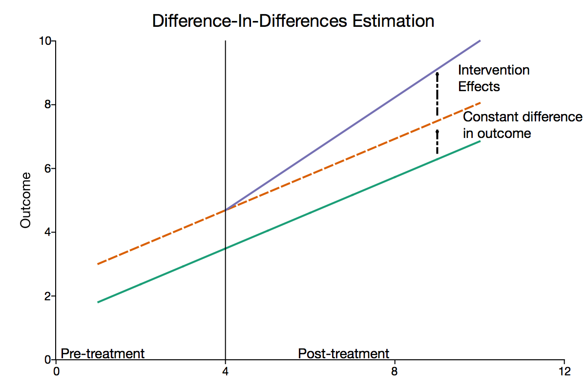{width=70%}</center>

<br>

For our purposes, difference-in-difference asks, **is there a difference in trips on streets with a new bike lane compared to similar streets without a bike lane?** We chose two areas of Manhattan in which to test this difference-in-difference exploratory approach: **East Harlem** and **Lower Manhattan**. Both areas had new bike lanes that were added in 2018 and were served by the Citibike network.

<br>

### Lower Manhattan
<center>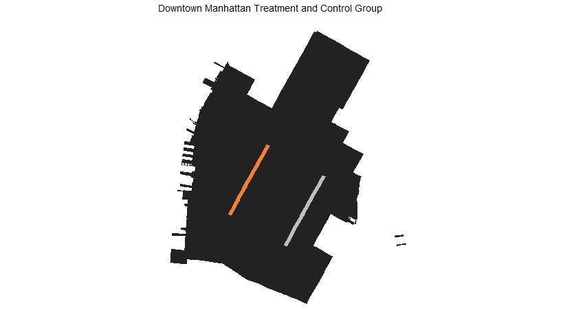{width=70%}</center>

<br>
Lower Manhattan saw the longest addition of **protected bike lane** in 2018, on 7th Avenue. We chose 3rd Avenue as the control because it was one of few parallel streets in the area without a bike lane. 

<br>

Treatment: 7th Avenue | Control: 3rd Avenue
----------------------|--------------------
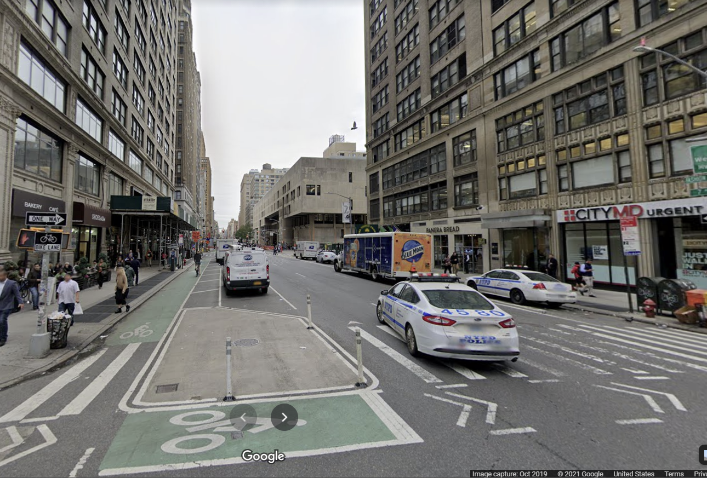|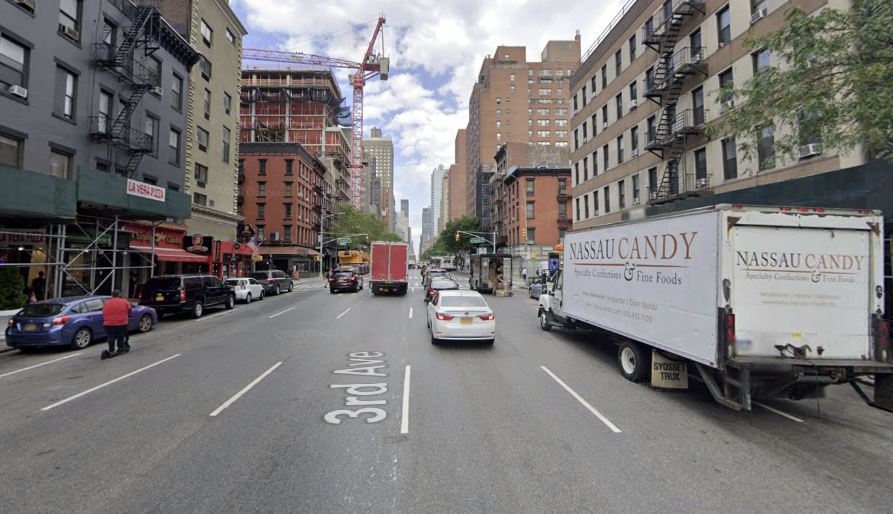

<br>

<center>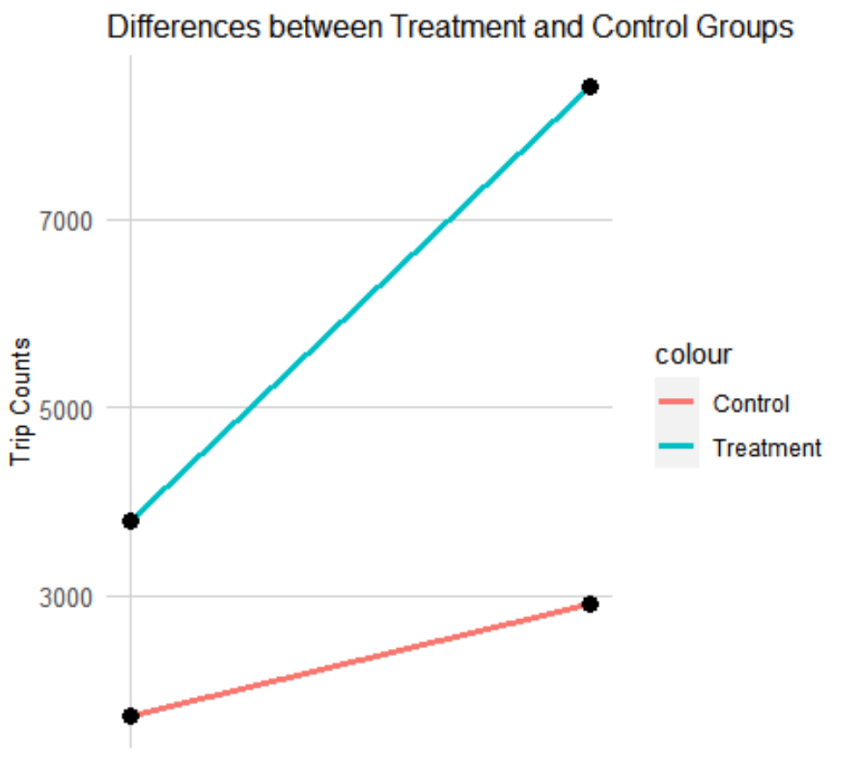{width=50%}</center>
```{r, echo=FALSE, fig.width=7}
lowerMH_results%>%
  kbl(caption = 'Lower Manhattan Difference in Difference Results')%>%
  kable_styling(bootstrap_options = c('striped', 'hover'))
```

Our difference in difference results for lower Manhattan show that the treatment group saw a larger increase in bikeshare trips than the control. This suggests that the new protected bike lane on 7th avenue may have had a positive impact on ridership. 

<br>

### East Harlem
<center>{width=70%}</center>

<br>

To test this approach in another neighborhood, we chose East Harlem because it is less dense than lower Manhattan, but had several bike lanes added in 2018. Unlike 7th avenue, all of these additions were **unprotected bike lanes**. We chose 4 other side streets as controls. 

<br>

Treatment: E 110th St | Control: E 109th St
----------------------|--------------------
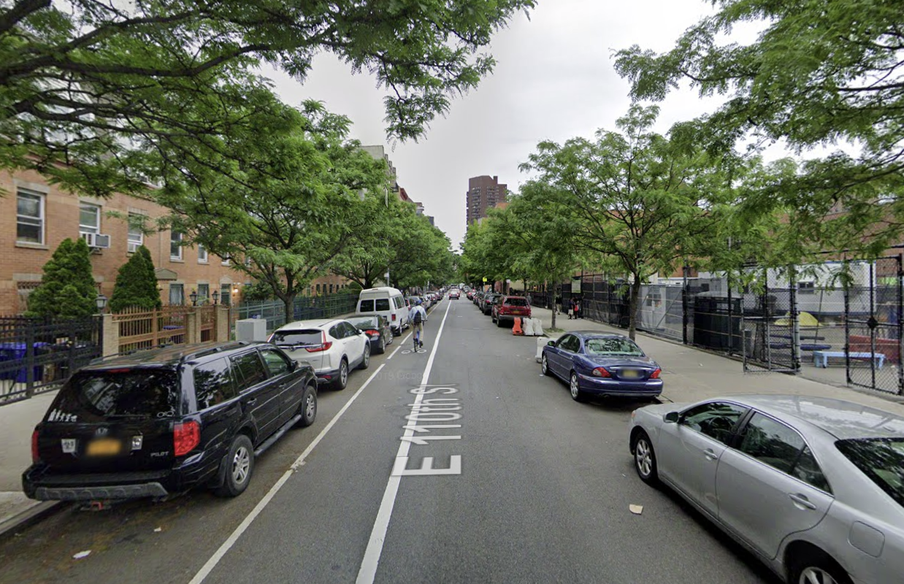|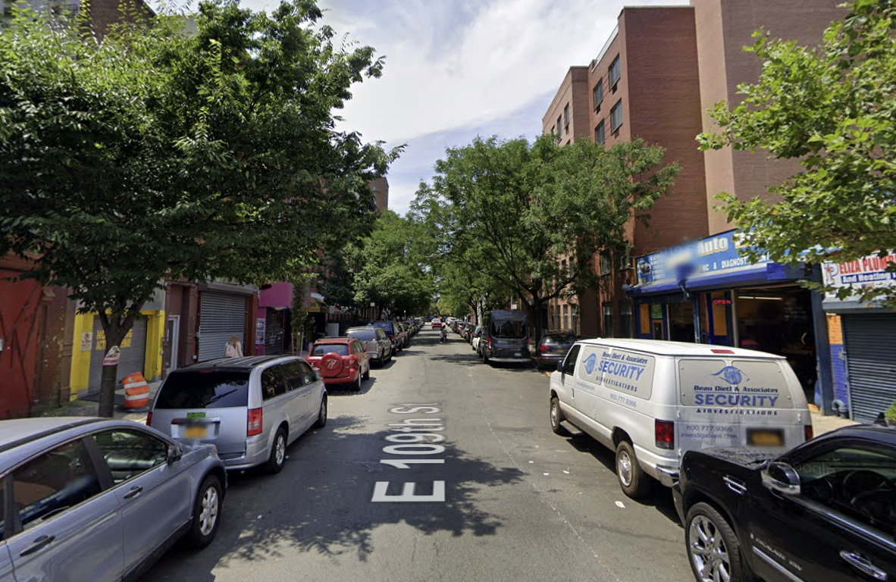

<br>

<center>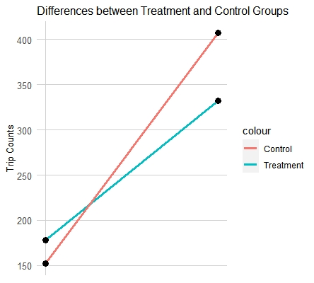{width=50%}</center>
```{r, echo=FALSE, fig.width=7}
eHarlem_results%>%
  kbl(caption = 'East Harlem Difference in Difference Results')%>%
  kable_styling(bootstrap_options = c('striped', 'hover'))
```

The results of the East Harlem difference in difference analysis show that the control group actually had a larger increase in trips that the treatment group and overtook the treatment group. Perhaps because the ridership on these streets is only in the hundreds rather than the thousands, a smaller change in actual riders can have a larger effect on the outcome. These results could also suggest that unprotected bike lanes do not encourage bikeshare ridership as much as protected bike lanes. Further difference in difference analyses at different time points and regions of the city would be needed to elaborate the interactions between new bike lanes and Citibike ridership. 

# 4. Feature Engineering
Our exploratory difference in difference results are encouraging and may suggest that adding bike lanes, or at least protected bike lanes, to the network over time has helped create a more welcoming environment for cyclists. However, to build a scenario planning tool for our client, we needed to develop
a predictive model that would allow us to predict the change in ridership once a new bike lane was added. 


### Correlations{.tabset}
We explored several features to investigate which were were the best predictors of bikeshare ridership. We tested features of the street centerline data itself, such as road width and speed limit, as well as demographics from the American Community Survey and amenities from OpenStreetMap and OpenData NYC. The below charts show the correlation between each predictor and the dependent variable, Count. 

#### Street Network
```{r, echo=FALSE, fig.height=6, fig.align='center', warning=FALSE, message=FALSE}
ggplot(correlation.long_t, aes(Value, Count)) +
  geom_point(size = 0.1) +
  geom_text(data = correlation.cor_t, color='blue', aes(label = paste("r =", round(correlation, 2))),
            x=-Inf, y=Inf, vjust = 1.5, hjust = -.1) +
  geom_smooth(method = "lm", se = FALSE, colour = "blue") +
  facet_wrap(~Variable, ncol = 2, scales = "free") +
  labs(title = "Count of trips as a function of LION and citibike features")

```

#### Demographics
```{r, echo=FALSE, message=FALSE, warning=FALSE, fig.height=6, fig.align='center'}
ggplot(correlation.long_c, aes(Value, Count)) +
  geom_point(size = 0.1) +
  geom_text(data = correlation.cor_c, aes(label = paste("r =", round(correlation, 2))),
            x=-Inf, y=Inf, vjust = 1.5, hjust = -.1, color='blue') +
  geom_smooth(method = "lm", se = FALSE, colour = "blue") +
  facet_wrap(~Variable, ncol = 2, scales = "free") +
  labs(title = "Count of trips as a function of census features")

```

#### Amenities
```{r, echo=FALSE, warning=FALSE, message=FALSE, fig.height=6, fig.align='center'}

ggplot(correlation.long_a, aes(Value, Count)) +
  geom_point(size = 0.1) +
  geom_text(data = correlation.cor_a, aes(label = paste("r =", round(correlation, 2))),
            x=-Inf, y=Inf, vjust = 1.5, hjust = -.1, color='blue') +
  geom_smooth(method = "lm", se = FALSE, colour = "blue") +
  facet_wrap(~Variable, ncol = 2, scales = "free") +
  labs(title = "Count of trips as a function of amenity features")

```

We also analyzed these independent variables for multicollinearity, as shown in the plot below. The two most correlated features were median rent and the percentage of White residents. However, the correlation value between these two features was less than 0.8, so both were included. 

```{r, echo=FALSE, fig.height=5, fig.align='center', warning=FALSE, message=FALSE}
ggcorrplot(corr, hc.order = TRUE, type='lower', insig='blank')

```

Our final model included the following features: 

* Street Network
  + **Bike Lane**: Protected vs Unprotected vs None
  + **Number of Vehicle Travel Lanes**
  + **Street Width**
  + **Truck Route**
  + **Greenway** Yes/No
* Bike Lane & Citibike Networks
  + **Distance to the Nearest Bike Lane**
  + **Number of Citibike Stations**: within 250 ft
* Demographics
  + **Median Rent**
  + **Percent White Residents**
  + **Percent Without a Vehicle**
  + **Percent who Commute by Subway**
* Amenities
  + **Jobs in Census Tract**
  + **Office Density**
  + **Retail Density**
  + **Large Park**: whether in a large park
  + **Distance to Subway Station**
  + **Distance to Sidewalk Cafe**
* Geography
  + **Neighborhood Tabulation Area**
  + **Manhattan**: Yes/No
  + **Spatial Lag**: average trip count of 5 nearest street segments

# 5. Modeling

### Model Basics{.tabset}
We modeled Citibike ridership on each street segment in our study area in the first two weeks of August 2020. We chose August 2020 because it was both a warm month good for biking and the first month in which Citibike stations were open in the Bronx, which we felt was important to include. Though bikeshare ridership trends have shifted during the pandemic, we modeled the total ridership over a two week period, so the changes in peak commuting patterns during the COVID-19 pandemic were not a concern for our model. 


# 6. Scenarios
We used our model to explore several scenarios where new bike lanes could be added in the future. Each scenario is comprised of several similar streets that could serve as alternatives to each other. For example, the Central Park Transverses Scenario is made up of 4 streets that cross Central Park, none of which have bike lanes. Comparing the predicted increase ridership across these scenarios could be a helpful tool for planners to decide which alternative would be most impactful.

<br>
### 6.1 Scenarios Chosen
```{r, echo=FALSE, fig.align='center'}

scenario_map<- ggplot() +
  geom_sf(data = borough_sa, fill = "#eeeeee", color='#aaaaaa') +
  geom_sf(data = scenarios, aes(color =Scenario), size=1) +
  scale_colour_brewer(palette='Dark2')+
  labs(title="Bike Planning Scenarios")+
  mapTheme

scenario_map

```


```{r, echo=FALSE, fig.align='center'}

scenarios_forTable%>%
  kbl(caption='Streets Chosen for Each Scenario')%>%
  kable_styling(bootstrap_options = c('striped', 'hover'))

```
<br>

For each scenario, we predicted the change in ridership that would be expected if a protected or unprotected bikelane were added to each street. In the case of Upper Manhattan, several of the avenues already had an unprotected bike lane, so we only predicted the change in ridership that would be expected from an increase to a protected bike lane. 

### 6.2 Predictions

# 7. Code Appendix

Calculating Ridership
```{r, eval=FALSE, echo=TRUE}
# Calculating Ridership
# pre-processing steps: 
## generate points from line trip data (see section 2.2)
## buffer street centerlines to desired distance (15ft in this analysis)

library(sf)
library(tidyverse)
library(mapview)

#read in data
points_new<-st_read('Aug1_14_points.shp')

extent <- st_read("station_extent_Aug2020.shp") %>%
  st_transform(st_crs(points_new))

cd<-st_read('https://data.cityofnewyork.us/resource/jp9i-3b7y.geojson') %>%
  st_transform(st_crs(points_new))

cd_extent<-st_intersection(cd, extent)


#clip points to study area extent
points_new_extent<-st_intersection(points_new, extent)

#bring in roads
bike20d_buffer <- st_read("lion2020d_buffer15.shp") %>%
  st_transform(st_crs(points_new))

# filter out non-bikeable LION segments (e.g. highways and ferry routes)
bike20d_buffer<- subset(bike20d_buffer, RW_TYPE != 12 &
                RW_TYPE != 7 &
                RW_TYPE != 14 &
                RW_TYPE != 2 &
                RW_TYPE != 4 &
                FeatureTyp != 1 &
                FeatureTyp != 2 &
                FeatureTyp != 3 &
                FeatureTyp != 5 &
                FeatureTyp != 7 &
                FeatureTyp != 8 &
                FeatureTyp != 9 &
                SegmentTyp !='E'&
                SegmentTyp !='G'&
                SegmentTyp !='F'&
                SegmentTyp !='T')

#segment ID is not unique, so select distinct segment IDs
bike20d_buffer <- distinct(bike20d_buffer,SegmentID,.keep_all = T)

#clip street segments to study area
bike20d_buffer<- st_intersection(bike20d_buffer, extent)

save.image(file = "pointsClean_raw.RData")


#function that cleans points for one community district
cleaner<- function(cb){
  cd_chosen<- cd %>%
    filter(boro_cd==cb)
  streets <- st_intersection(bike20d_buffer, cd_chosen)
  points_extent <- st_intersection(points_new_extent, cd_chosen)
  points_clean <- points_extent[streets,]%>%
    mutate(pnt_id = seq.int(nrow(.))) %>%
    st_join(., streets, join=st_intersects, left=T, largest=TRUE)
  return(points_clean)
}

#run the function for each cd
#Manhattan
points_clean_101<- cleaner('101')
points_clean_102<- cleaner('102')
points_clean_103<- cleaner('103')
points_clean_104<- cleaner('104')
points_clean_105<- cleaner('105')
points_clean_106<- cleaner('106')
points_clean_108<- cleaner('108')
points_clean_164<- cleaner('164')
points_clean_107<- cleaner('107')
points_clean_111<- cleaner('111')
points_clean_110<- cleaner('110')
points_clean_109<- cleaner('109')
points_clean_112<- cleaner('112')

save.image(file = "pointsClean_Manhattan.RData")

points_clean_201<- cleaner('201')
points_clean_202<- cleaner('202')
points_clean_203<- cleaner('203')
points_clean_204<- cleaner('204')

save.image(file = "pointsClean_MHBX.RData")


points_clean_301<- cleaner('301')
points_clean_302<- cleaner('302')
points_clean_303<- cleaner('303')
points_clean_304<- cleaner('304')
points_clean_306<- cleaner('306')
points_clean_308<- cleaner('308')
points_clean_307<- cleaner('307')
points_clean_355<- cleaner('355')
points_clean_309<- cleaner('309')
points_clean_316<- cleaner('316')

save.image(file = "pointsClean_MHBXBK.RData")

points_clean_405<- cleaner('405')
points_clean_402<- cleaner('402')
points_clean_401<- cleaner('401')

save.image(file = "pointsClean_MHBXBKQN.RData")


#function for counting trips
countTrip <- function(pnt){
  tripCount <- pnt %>%
    as.data.frame() %>%
    select(-geometry) %>%
    group_by(FID_1,SegmentID) %>%
    summarise() %>%
    group_by(SegmentID) %>%
    summarise(tripCount = n())
  return(tripCount)
}

#count trips in the previous dataframe
count_101 <- countTrip(points_clean_101)
count_102 <- countTrip(points_clean_102)
count_103 <- countTrip(points_clean_103)
count_104 <- countTrip(points_clean_104)
count_105 <- countTrip(points_clean_105)
count_106 <- countTrip(points_clean_106)


count_107 <- countTrip(points_clean_107)
count_108 <- countTrip(points_clean_108)
count_109 <- countTrip(points_clean_109)
count_110 <- countTrip(points_clean_110)
count_111 <- countTrip(points_clean_111)
count_112 <- countTrip(points_clean_112)
count_164 <- countTrip(points_clean_164)

count_301 <- countTrip(points_clean_301)
count_302 <- countTrip(points_clean_302)
count_303 <- countTrip(points_clean_303)
count_304 <- countTrip(points_clean_304)
count_306 <- countTrip(points_clean_306)
count_307 <- countTrip(points_clean_307)
count_308 <- countTrip(points_clean_308)
count_309 <- countTrip(points_clean_309)
count_316 <- countTrip(points_clean_316)
count_355 <- countTrip(points_clean_355)


count_201 <- countTrip(points_clean_201)
count_202 <- countTrip(points_clean_202)
count_203 <- countTrip(points_clean_203)
count_204 <- countTrip(points_clean_204)


count_401 <- countTrip(points_clean_401)
count_402 <- countTrip(points_clean_402)
count_405 <- countTrip(points_clean_405)

save.image(file = "pointsCounted.RData")


#join the counted trips to the road data
#Manhattan
new_info.Aug <- lion %>% 
  merge(.,new_tripCount,by = "SegmentID",all.x = T) %>% 
  rename(Count=tripCount)

info.Aug_101<- bike20d_buffer %>% 
  merge(., count_101, by='SegmentID', all.y=T)%>%
  rename(Count=tripCount)

info.Aug_102<- bike20d_buffer %>% 
  merge(., count_102, by='SegmentID', all.y=T)%>%
  rename(Count=tripCount)

info.Aug_103<- bike20d_buffer %>% 
  merge(., count_103, by='SegmentID', all.y=T)%>%
  rename(Count=tripCount)
info.Aug_104<- bike20d_buffer %>% 
  merge(., count_104, by='SegmentID', all.y=T)%>%
  rename(Count=tripCount)
info.Aug_105<- bike20d_buffer %>% 
  merge(., count_105, by='SegmentID', all.y=T)%>%
  rename(Count=tripCount)
info.Aug_106<- bike20d_buffer %>% 
  merge(., count_106, by='SegmentID', all.y=T)%>%
  rename(Count=tripCount)
info.Aug_107<- bike20d_buffer %>% 
  merge(., count_107, by='SegmentID', all.y=T)%>%
  rename(Count=tripCount)
info.Aug_108<- bike20d_buffer %>% 
  merge(., count_108, by='SegmentID', all.y=T)%>%
  rename(Count=tripCount)
info.Aug_109<- bike20d_buffer %>% 
  merge(., count_109, by='SegmentID', all.y=T)%>%
  rename(Count=tripCount)
info.Aug_110<- bike20d_buffer %>% 
  merge(., count_110, by='SegmentID', all.y=T)%>%
  rename(Count=tripCount)
info.Aug_111<- bike20d_buffer %>% 
  merge(., count_111, by='SegmentID', all.y=T)%>%
  rename(Count=tripCount)
info.Aug_112<- bike20d_buffer %>% 
  merge(., count_112, by='SegmentID', all.y=T)%>%
  rename(Count=tripCount)
info.Aug_164<- bike20d_buffer %>% 
  merge(., count_164, by='SegmentID', all.y=T)%>%
  rename(Count=tripCount)

#bronx
info.Aug_201<- bike20d_buffer %>% 
  merge(., count_201, by='SegmentID', all.y=T)%>%
  rename(Count=tripCount)
info.Aug_202<- bike20d_buffer %>% 
  merge(., count_202, by='SegmentID', all.y=T)%>%
  rename(Count=tripCount)
info.Aug_203<- bike20d_buffer %>% 
  merge(., count_203, by='SegmentID', all.y=T)%>%
  rename(Count=tripCount)
info.Aug_204<- bike20d_buffer %>% 
  merge(., count_204, by='SegmentID', all.y=T)%>%
  rename(Count=tripCount)

#brooklyn
info.Aug_301<- bike20d_buffer %>% 
  merge(., count_301, by='SegmentID', all.y=T)%>%
  rename(Count=tripCount)
info.Aug_302<- bike20d_buffer %>% 
  merge(., count_302, by='SegmentID', all.y=T)%>%
  rename(Count=tripCount)
info.Aug_303<- bike20d_buffer %>% 
  merge(., count_303, by='SegmentID', all.y=T)%>%
  rename(Count=tripCount)
info.Aug_304<- bike20d_buffer %>% 
  merge(., count_304, by='SegmentID', all.y=T)%>%
  rename(Count=tripCount)
info.Aug_306<- bike20d_buffer %>% 
  merge(., count_306, by='SegmentID', all.y=T)%>%
  rename(Count=tripCount)
info.Aug_307<- bike20d_buffer %>% 
  merge(., count_307, by='SegmentID', all.y=T)%>%
  rename(Count=tripCount)
info.Aug_308<- bike20d_buffer %>% 
  merge(., count_308, by='SegmentID', all.y=T)%>%
  rename(Count=tripCount)
info.Aug_309<- bike20d_buffer %>% 
  merge(., count_309, by='SegmentID', all.y=T)%>%
  rename(Count=tripCount)
info.Aug_316<- bike20d_buffer %>% 
  merge(., count_316, by='SegmentID', all.y=T)%>%
  rename(Count=tripCount)
info.Aug_355<- bike20d_buffer %>% 
  merge(., count_355, by='SegmentID', all.y=T)%>%
  rename(Count=tripCount)

#queens
info.Aug_401<- bike20d_buffer %>% 
  merge(., count_401, by='SegmentID', all.y=T)%>%
  rename(Count=tripCount)
info.Aug_402<- bike20d_buffer %>% 
  merge(., count_402, by='SegmentID', all.y=T)%>%
  rename(Count=tripCount)
info.Aug_405<- bike20d_buffer %>% 
  merge(., count_405, by='SegmentID', all.y=T)%>%
  rename(Count=tripCount)

#rbind everything back together

all_test<- rbind(info.Aug_101, info.Aug_102, info.Aug_103, info.Aug_104, info.Aug_105,
                 info.Aug_106, info.Aug_107, info.Aug_108, info.Aug_109, info.Aug_110,
                 info.Aug_111, info.Aug_112, info.Aug_164, info.Aug_201, info.Aug_202, 
                 info.Aug_203, info.Aug_204, info.Aug_301, info.Aug_302, info.Aug_303,
                 info.Aug_304, info.Aug_306, info.Aug_307, info.Aug_308, info.Aug_309,
                 info.Aug_316, info.Aug_355, info.Aug_401, info.Aug_402, info.Aug_405)

glimpse(all_test)

#group by street and segment id and sum ridership (some streets are split by community districts)
all_grouped<-all_test%>%
  group_by(Street, SegmentID)%>%
  summarize(Count=sum(Count))
all_grouped<-st_set_geometry(all_grouped, NULL)


#join it back to the original bike20d_buffer or somehow bring back the segments with count0
mergeCols <- c("Street", "SegmentID")
ridership<- bike20d_buffer%>%
  merge(., all_grouped, by=mergeCols, all.x=T)
ridership$Count[is.na(ridership$Count)] <- 0

#export as RData
save.image(file = "ridership.RData")
```

Difference in Difference Analysis
```{r, eval=FALSE, echo=TRUE}
#Difference in Difference
#pre-processing: select the street segments that will be each treatment and control group


```

Feature Engineering
```{r, eval=FALSE, echo=TRUE}
#Feature Engineering
#pre-steps: download LEHD work area characteristics data

library(tidyverse)
library(dplyr)
library(sf)
library(lubridate)
library(mapview)
library(viridis)
library(ggplot2)
library(kableExtra)
library(stargazer)
library(FNN)
library(ggcorrplot)
library(spdep)
library(plotly)
library(car)
library(ranger)
library(tidycensus)
library(corpcor)
library(caret)
library(rjson)
library(tidyr)
library(sp)
library(osmdata)

load("ridership.RData")

#NYC boroughs
borough<- st_read('https://data.cityofnewyork.us/resource/7t3b-ywvw.geojson')%>%
  st_transform(st_crs(ridership))

boros_4<-subset(borough, boro_code<5)


#citibike stations
station<- st_read('Infrastructure/Citibike_Stations/Stations_Aug_2020.shp')%>%
  st_transform(st_crs(ridership))

#Station Extent
extent <- st_read('OtherData/Station_Extent_2020/station_extent_Aug2020.shp')%>%
  st_transform(st_crs(ridership))

#boroughs within study area
boroughs_clip<-st_intersection(borough, extent)


#neighborhoods
neighborhood <- st_read('https://data.cityofnewyork.us/resource/q2z5-ai38.geojson')%>%
  st_transform(st_crs(ridership))


#only neighborhood in citibike extent
neighborhood <- neighborhood[extent,]


#set ridership to info.Aug
info.Aug<-ridership

#add bike lane level
info.Aug <- info.Aug %>% 
  mutate(
    bikeLaneLv = case_when(
      BikeLane == 1 | BikeLane == 5 | BikeLane == 8 | BikeLane == 9 | BikeLane == 10 ~ "Protected",
      BikeLane == 2 | BikeLane == 3 | BikeLane == 4 | BikeLane == 6 | BikeLane == 11 ~ "Unprotected",
      TRUE ~ "noBikeLane"
    ))


#select useful columns
info.Aug <- info.Aug %>%
  select(Street,SegmentID, Count, FeatureTyp, SegmentTyp, NonPed,
         TrafDir, SegCount, LBoro, XFrom, YFrom, RW_TYPE, Snow_Prior,
         Number_Tra, BIKE_TRAFD, 
         StreetWidt, TRUCK_ROUT, POSTED_SPE,  
         bikeLaneLv, geometry)

# collect bike lane information
bikelanes <- info.Aug %>% filter(bikeLaneLv!="noBikeLane")


####=====Feature Engineering========####
#change projection
#info.Aug <- info.Aug %>% st_transform('ESRI:102711')
#bike20d_buffer <- bike20d_buffer %>% st_transform('ESRI:102711')
#bikelanes <- bikelanes %>% st_transform('ESRI:102711')
#station <- station %>% st_transform('ESRI:102711')

#Number of trips in each neighborhood
info.Aug_nh <- st_join(info.Aug, neighborhood, join=st_intersects, left=TRUE,largest = TRUE)
info.Aug <- info.Aug_nh %>% select(-(ntacode:county_fips),-shape_leng, -boro_code)


## bring this line to above to the neighborhood joining part
info.Aug <- info.Aug %>% 
  mutate(
    ntaname = case_when(
      is.na(ntaname) ~ "Connecting Neighborhoods",
      TRUE ~ ntaname
    ))

###Distance to nearest bikelanes
info.Aug <- info.Aug %>%
  mutate(dist.lane = nn_function(st_coordinates(st_centroid(info.Aug$geometry)), st_coordinates(st_centroid(bikelanes$geometry)), 1))


#borough
info.Aug$isMH<-0
info.Aug$isMH[info.Aug$LBoro==1]<-1

#travel lanes
info.Aug$Number_Tra <- as.numeric(info.Aug$Number_Tra)


#citibike stations
#drop all columns but geometry
station<-station%>%
  select()

View(info.Aug)

info.Aug$citibike.Buffer_small <-
  st_buffer(info.Aug, 250) %>% 
  aggregate(mutate(station, counter = 1),., sum) %>%
  pull(counter)
info.Aug$citibike.Buffer_small[is.na(info.Aug$citibike.Buffer_small)] <- 0

#fixNAs
#find averages
median_lanes <- median(info.Aug$Number_Tra, na.rm=TRUE)
median_width<- median(info.Aug$StreetWidt, na.rm = TRUE)
info.Aug$POSTED_SPE<- as.numeric(info.Aug$POSTED_SPE)
median_speed<-median(info.Aug$POSTED_SPE, na.rm=TRUE)


info.Aug$Number_Tra[is.na(info.Aug$Number_Tra)] <- median_lanes
info.Aug$StreetWidt[is.na(info.Aug$StreetWidt)] <- median_width
info.Aug$TRUCK_ROUT[is.na(info.Aug$TRUCK_ROUT)] <- 0
info.Aug$POSTED_SPE[is.na(info.Aug$POSTED_SPE)] <- median_speed


#### Census Features ####
#variables available at: https://api.census.gov/data/2019/acs/acs5/variables.html
v19 <- load_variables(2019, "acs5", cache = TRUE)

census_df <- data.frame(vars = c("B01003_001E",
                                 'B02001_002E',
                                 'B01001A_002E',
                                 'B01001A_017E',
                                 'B01002_001E',
                                 'B19013_001E',
                                 'B25031_001E',
                                 'B25044_001E',
                                 'B08006_003E',
                                 'B08006_010E',
                                 'B08131_001E',
                                 'B08141_002E',
                                 'B08141_001E',
                                 'B08303_001E',
                                 'B03001_003E',
                                 'B26001_001E', #GROUP QUARTERS POPULATION
                                 'B25007_012E',
                                 #'B08201_001E',
                                 'B25002_001E',
                                 'B25002_003E',
                                 'B08006_014E'),
                        colNames2 = c('TotPop',
                                      'WhitePop',
                                      'TotMale',
                                      'TotFemale',
                                      'MedianAge',
                                      'MedHHInc',
                                      'MedRent',
                                      'Vehicles_Avail',
                                      'Commute_DriveAlone',
                                      'Commute_Subway',
                                      'Travel_Time',
                                      'No_Vehicle',
                                      'Means_of_Transport_pop',
                                      'Travel_Time_pop',
                                      'LatinoPop',
                                      'GroupQuarters',
                                      'NumRenters',
                                      #'AvgHHSize',
                                      'TotUnits',
                                      'VacUnits',
                                      'Commute_Bike'),
                        stringsAsFactors = FALSE)

census_vars <- census_df$vars
census_colNames <- census_df$colNames

# Function for renaming columns after collecting census data
rename_census_cols <- function(x){
  
  output <- x %>% 
    rename_at(vars(census_vars), 
              ~ census_colNames)
  
  output
}

#set census api key
census_key <- 'your census key here'
census_api_key(census_key, overwrite = TRUE, install = TRUE)

# Collect census data and geometries
Census_raw <- get_acs(geography = "tract", 
                      variables = census_vars, 
                      year = 2019, 
                      state = "NY", 
                      geometry = TRUE, 
                      county = c("New York", "Kings", "Queens", "Bronx"),
                      output = "wide") %>%
  rename_census_cols %>%
  dplyr::select(GEOID, 
                geometry,
                census_colNames) %>% 
  st_transform(2263)

Census_raw <- Census_raw%>%
  st_transform(2263)%>%
  mutate(AREA=st_area(geometry))
Census_raw <- Census_raw%>%
  st_transform(2263)%>%
  mutate(sq_mi=AREA/27878400)

#fix NAs 
colSums(is.na(Census_raw))

median_rent<-median(Census_raw$MedRent, na.rm=TRUE)
Census_raw$MedRent[is.na(Census_raw$MedRent)] <- median_rent

# calculate some vars
Census <- Census_raw %>% 
  st_transform(2263) %>% 
  mutate(pWhite = WhitePop / TotPop,
         PopDens = TotPop/sq_mi,
         Mean_Commute_Time = Travel_Time / Travel_Time_pop,
         pSubway = Commute_Subway / Means_of_Transport_pop,
         pDrive = Commute_DriveAlone/Means_of_Transport_pop,
         pBike = Commute_Bike/Means_of_Transport_pop,
         pNoVeh = No_Vehicle / TotPop)

#fix weird values in calculated vars
#set infinity values to NA
Census_geo<-Census%>%
  select(GEOID)

Census_st<- st_set_geometry(Census, NULL)
Census_fix <- do.call(data.frame, lapply(Census_st, function(x) replace(x, is.infinite(x), NA)))


#fix NAs in calculated vars
colSums(is.na(Census_fix))

median_pWhite<-median(Census_fix$pWhite, na.rm=TRUE)
median_subway<-median(Census_fix$pSubway, na.rm=TRUE)
median_noveh<-median(Census_fix$pNoVeh, na.rm=TRUE)
median_rent<-median(Census_fix$MedRent, na.rm=TRUE)


Census_fix$pWhite[is.na(Census_fix$pWhite)] <- median_pWhite
Census_fix$pSubway[is.na(Census_fix$pSubway)] <- median_subway
Census_fix$pNoVeh[is.na(Census_fix$pNoVeh)] <- median_noveh
Census_fix$pNoVeh[is.na(Census_fix$MedRent)] <- median_rent


#if % greater than 1, set value equal to median
summary(Census_fix)
Census_fix$pSubway[Census_fix$pSubway>1.01] <- median_subway

#get geometry back
Census<- inner_join(Census_geo, Census_fix)

#select the variables of interest
#Census <- Census %>%
#  select(GEOID, sq_mi,pWhite, pSubway, pNoVeh,MedRent)

#join with info.Aug
Census<-st_transform(Census, crs=st_crs(info.Aug))
info.Aug_census<-st_join(st_centroid(info.Aug), left=TRUE, Census)

summary(is.na(info.Aug_census))
summary(is.na(Census))
#You will find there are 16 records not joined to a census tract
#They are joined becuase they are falling outside of (near) the boundary of the tract polygon
#We will join them to the nearest census tract
colNms <- names(info.Aug_census)
ThoseNotJoined <- info.Aug_census[is.na(info.Aug_census$GEOID),] %>% select(all_of(colNms))
joinThemAgain <- st_join(ThoseNotJoined,Census,left=T,join = st_nearest_feature)
ThoseJoined <- info.Aug_census[!is.na(info.Aug_census$GEOID),]
info.Aug_census <- rbind(ThoseJoined,joinThemAgain)

rm(ThoseJoined,ThoseNotJoined,joinThemAgain)
info.Aug<-info.Aug_census

#### Environment Features ####

#make new dataset to play with
info.Aug_env<- info.Aug

#sidewalk cafes
sidewalk_cafe<- read.csv('https://data.cityofnewyork.us/resource/qcdj-rwhu.csv?$limit=2000')
sidewalk_cafe<-subset(sidewalk_cafe, lic_status =='Active')
sidewalk_cafe <- st_as_sf(sidewalk_cafe, coords=c('longitude', 'latitude'), crs=4326)

#nn version
sidewalk_cafe<-st_transform(sidewalk_cafe, crs=st_crs(info.Aug))

info.Aug_env<- info.Aug_env %>%
  mutate(
    sidewalk_caf_nn3 = nn_function(st_coordinates(st_centroid(info.Aug_env)), st_coordinates(sidewalk_cafe), 3))


#big parks
parks<- st_read('OtherData/parks/geo_export_8469ffba-1951-4e52-916c-c9c4dfa54c18.shp')

big_parks<-subset(parks, acres>100)

big_parks<-st_transform(big_parks, crs=st_crs(info.Aug_env))

info.Aug_env<- info.Aug_env %>% 
  mutate(bigPark = lengths(st_within(geometry, big_parks)))
info.Aug_env$bigPark[info.Aug_env$bigPark==2]<-1


#greenway
info.Aug_env$isGreenway<-ifelse(grepl('greenway', info.Aug_env$Street, ignore.case=T), 1, 0)

#distance to subway stations
subway<-st_read('stops_nyc_subway_may2019.shp')
subway<-st_read('OtherData/NYC_Subway/stops_nyc_subway_may2019.shp')

subway<-st_transform(subway, st_crs(info.Aug_env))


info.Aug_env<- info.Aug_env %>%
  mutate(subway_nn5 = nn_function(st_coordinates(st_centroid(info.Aug_env)), st_coordinates(subway), 5))


#reset whole dataset to include these features
info.Aug<-info.Aug_env

# jobs
jobs_mh<-st_read('LODES_WAC/manhattan/points_2018.shp')
jobs_bx<-st_read('LODES_WAC/bronx/points_2018.shp')
jobs_bk<-st_read('LODES_WAC/brooklyn/points_2018.shp')
jobs_qn<-st_read('LODES_WAC/queens/points_2018.shp')

jobs_mh<-st_read('OtherData/LODES_WAC/manhattan/points_2018.shp')
jobs_bx<-st_read('OtherData/LODES_WAC/bronx/points_2018.shp')
jobs_bk<-st_read('OtherData/LODES_WAC/brooklyn/points_2018.shp')
jobs_qn<-st_read('OtherData/LODES_WAC/queens/points_2018.shp')


jobs<-rbind(jobs_mh, jobs_bx, jobs_bk, jobs_qn)

WAC <- jobs %>% 
  dplyr::select(id, c000) %>% 
  mutate(GEOID = as.character(substr(id, 1, 11))) %>% 
  group_by(GEOID) %>% 
  summarize(jobs_in_tract = sum(c000, na.rm = TRUE)) %>% 
  filter(GEOID %in% info.Aug$GEOID)

WAC<-st_set_geometry(WAC, NULL)

info.Aug_jobs<- left_join(info.Aug, WAC,by = "GEOID")

#get rid of NAs
info.Aug_jobs$jobs_in_tract[is.na(info.Aug_jobs$jobs_in_tract)] <- 0

info.Aug<-info.Aug_jobs

#### OSM Features ####
info.Aug_osm<-info.Aug

#retail
extent<- st_transform(extent, st_crs(info.Aug))

retail <- opq ("New York City USA") %>%
  add_osm_feature(key = 'shop') %>%
  osmdata_sf(.)

retail <- st_geometry(retail$osm_points) %>%
  st_transform(st_crs(info.Aug)) %>%
  st_sf() %>%
  st_intersection(extent) %>%
  mutate(Legend = 'Retail') %>%
  dplyr::select(Legend, geometry)

ggplot()+geom_sf(data=retail)

#office
office <- opq ("New York City USA") %>%
  add_osm_feature(key = 'office') %>%
  osmdata_sf(.)

office <- st_geometry(office$osm_points) %>%
  st_transform(st_crs(info.Aug)) %>%
  st_sf() %>%
  st_intersection(extent) %>%
  mutate(Legend = 'Office') %>%
  dplyr::select(Legend, geometry)

#add density features
# retail
retail_ct <- st_join(retail, Census,join = st_intersects, left = T) %>%
  group_by(GEOID,sq_mi) %>%
  summarise(count_retail= n())

retail_ct$density_retail <- retail_ct$count_retail/retail_ct$sq_mi

# office
office_ct <- st_join(office,Census,left = T) %>% 
  group_by(GEOID,sq_mi) %>% 
  summarise(count_office = n())

office_ct$density_office <- office_ct$count_office/office_ct$sq_mi

#join back to info.Aug
retail_ct<- retail_ct%>%
  select(GEOID, count_retail, density_retail)%>%
  st_set_geometry(NULL)

office_ct<- office_ct%>%
  select(GEOID, count_office, density_office)%>%
  st_set_geometry(NULL)

info.Aug_osm <- info.Aug_osm %>% left_join(retail_ct,by = "GEOID") %>% 
  left_join(office_ct, by = "GEOID")

info.Aug<-info.Aug_osm

#fix NAs
colSums(is.na(info.Aug))

## I fill the na in POI with 0 instead of median here
info.Aug$count_retail[is.na(info.Aug$count_retail)] <- 0
info.Aug$count_office[is.na(info.Aug$count_office)] <- 0
info.Aug$density_retail[is.na(info.Aug$density_retail)] <- 0
info.Aug$density_office[is.na(info.Aug$density_office)] <- 0
                                         
                                         
## Spatial lag
                                         
#function to get cloest idx
nn_idx<- nn_function <- function(measureFrom,measureTo,k) {
  measureFrom_Matrix <- as.matrix(measureFrom)
  measureTo_Matrix <- as.matrix(measureTo)
  nn <-   
    get.knnx(measureTo, measureFrom, k)$nn.index[,k]
  return(nn)  
}
 
#this index is the idex exactly for itselt-->so we start from 2
#make a copy                                         
info.Aug1 <- info.Aug
                                         
#C1
info.Aug <- info.Aug %>%
  mutate(cidx1 = nn_idx(st_coordinates(st_centroid(info.Aug$geometry)),
                        st_coordinates(st_centroid(info.Aug1$geometry)), 2))


#C2
info.Aug <- info.Aug %>%
  mutate(cidx2 = nn_idx(st_coordinates(st_centroid(info.Aug$geometry)),
                        st_coordinates(st_centroid(info.Aug1$geometry)), 3))


#C3
info.Aug <- info.Aug %>%
  mutate(cidx3 = nn_idx(st_coordinates(st_centroid(info.Aug$geometry)),
                        st_coordinates(st_centroid(info.Aug1$geometry)), 4))

#C4
info.Aug <- info.Aug %>%
  mutate(cidx4 = nn_idx(st_coordinates(st_centroid(info.Aug$geometry)),
                        st_coordinates(st_centroid(info.Aug1$geometry)), 5))

#C5
info.Aug <- info.Aug %>%
  mutate(cidx5 = nn_idx(st_coordinates(st_centroid(info.Aug$geometry)),
                        st_coordinates(st_centroid(info.Aug1$geometry)), 6))


#C6
info.Aug <- info.Aug %>%
  mutate(cidx6 = nn_idx(st_coordinates(st_centroid(info.Aug$geometry)),
                        st_coordinates(st_centroid(info.Aug1$geometry)), 7))

#C7
info.Aug <- info.Aug %>%
  mutate(cidx7 = nn_idx(st_coordinates(st_centroid(info.Aug$geometry)),
                        st_coordinates(st_centroid(info.Aug1$geometry)), 8))

#C8
info.Aug <- info.Aug %>%
  mutate(cidx8 = nn_idx(st_coordinates(st_centroid(info.Aug$geometry)),
                        st_coordinates(st_centroid(info.Aug1$geometry)), 9))


#C9
info.Aug <- info.Aug %>%
  mutate(cidx9 = nn_idx(st_coordinates(st_centroid(info.Aug$geometry)),
                        st_coordinates(st_centroid(info.Aug1$geometry)), 10))

#C10
info.Aug <- info.Aug %>%
  mutate(cidx10 = nn_idx(st_coordinates(st_centroid(info.Aug$geometry)),
                        st_coordinates(st_centroid(info.Aug1$geometry)), 11))                                        
                                         

                                         
#extract count based on index
for (i in 1:nrow(info.Aug)) {
  info.Aug$c1Count[i] =info.Aug1[info.Aug$cidx1[i],]$Count
}

for (i in 1:nrow(info.Aug)) {
  info.Aug$c2Count[i] =info.Aug1[info.Aug$cidx2[i],]$Count
}

for (i in 1:nrow(info.Aug)) {
  info.Aug$c3Count[i] =info.Aug1[info.Aug$cidx3[i],]$Count
}

for (i in 1:nrow(info.Aug)) {
  info.Aug$c4Count[i] =info.Aug1[info.Aug$cidx4[i],]$Count
}

for (i in 1:nrow(info.Aug)) {
  info.Aug$c4Count[i] =info.Aug1[info.Aug$cidx4[i],]$Count
}

for (i in 1:nrow(info.Aug)) {
  info.Aug$c5Count[i] =info.Aug1[info.Aug$cidx5[i],]$Count
}

for (i in 1:nrow(info.Aug)) {
  info.Aug$c6Count[i] =info.Aug1[info.Aug$cidx6[i],]$Count
}

for (i in 1:nrow(info.Aug)) {
  info.Aug$c7Count[i] =info.Aug1[info.Aug$cidx7[i],]$Count
}

for (i in 1:nrow(info.Aug)) {
  info.Aug$c8Count[i] =info.Aug1[info.Aug$cidx8[i],]$Count
}

for (i in 1:nrow(info.Aug)) {
  info.Aug$c9Count[i] =info.Aug1[info.Aug$cidx9[i],]$Count
}

for (i in 1:nrow(info.Aug)) {
  info.Aug$c10Count[i] =info.Aug1[info.Aug$cidx10[i],]$Count
}                                         
                                         
 #get the avg 10

for (i in 1:nrow(info.Aug)) {
  max_val = max(c(info.Aug$c1Count[i], info.Aug$c2Count[i], info.Aug$c3Count[i], info.Aug$c4Count[i], info.Aug$c5Count[i], info.Aug$c6Count[i], info.Aug$c7Count[i], info.Aug$c8Count[i], info.Aug$c9Count[i], info.Aug$c10Count[i]))
  min_val = min(c(info.Aug$c1Count[i], info.Aug$c2Count[i], info.Aug$c3Count[i], info.Aug$c4Count[i], info.Aug$c5Count[i], info.Aug$c6Count[i], info.Aug$c7Count[i], info.Aug$c8Count[i], info.Aug$c9Count[i], info.Aug$c10Count[i]))
  sum = (info.Aug$c1Count[i] + info.Aug$c2Count[i] + info.Aug$c3Count[i] + info.Aug$c4Count[i] + info.Aug$c5Count[i] + info.Aug$c6Count[i] + info.Aug$c7Count[i] + info.Aug$c8Count[i] + info.Aug$c9Count[i] + info.Aug$c10Count[i])
  left = sum - max_val - min_val
  info.Aug$avgCount10[i] = left/ 8
}


#get the avg7 
for (i in 1:nrow(info.Aug)) {
  max_val = max(c(info.Aug$c1Count[i], info.Aug$c2Count[i], info.Aug$c3Count[i], info.Aug$c4Count[i], info.Aug$c5Count[i], info.Aug$c6Count[i], info.Aug$c7Count[i]))
  min_val = min(c(info.Aug$c1Count[i], info.Aug$c2Count[i], info.Aug$c3Count[i], info.Aug$c4Count[i], info.Aug$c5Count[i], info.Aug$c6Count[i], info.Aug$c7Count[i]))
  sum = (info.Aug$c1Count[i] + info.Aug$c2Count[i] + info.Aug$c3Count[i] + info.Aug$c4Count[i] + info.Aug$c5Count[i] + info.Aug$c6Count[i] + info.Aug$c7Count[i])
  left = sum - max_val - min_val
  info.Aug$avgCount7[i] = left/5
}

#get the avg 5

for (i in 1:nrow(info.Aug)) {
  max_val = max(c(info.Aug$c1Count[i], info.Aug$c2Count[i], info.Aug$c3Count[i], info.Aug$c4Count[i], info.Aug$c5Count[i]))
  min_val = min(c(info.Aug$c1Count[i], info.Aug$c2Count[i], info.Aug$c3Count[i], info.Aug$c4Count[i], info.Aug$c5Count[i]))
  sum = (info.Aug$c1Count[i] + info.Aug$c2Count[i] + info.Aug$c3Count[i] + info.Aug$c4Count[i] + info.Aug$c5Count[i])
  left = sum - max_val - min_val
  info.Aug$avgCount5[i] = left/3
}                                        

```

Running the Model
```{r, eval=FALSE, echo=TRUE}
#Running the Model


```

Scenario Predictions
```{r, eval=FALSE, echo=TRUE}
#Scenario Predictions


```
